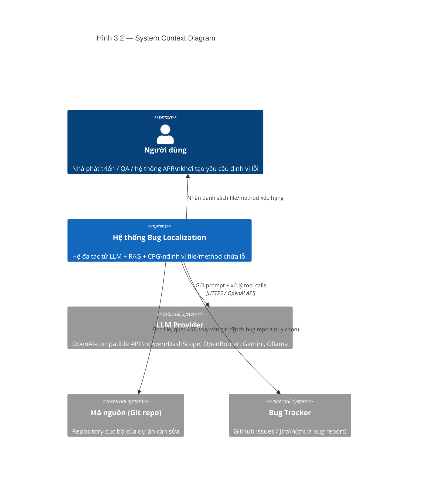
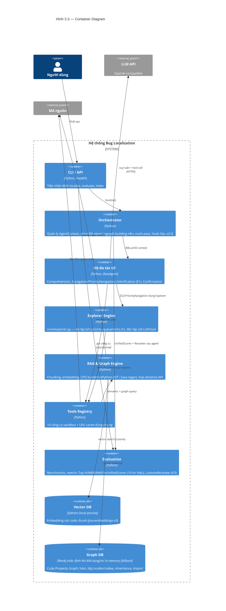
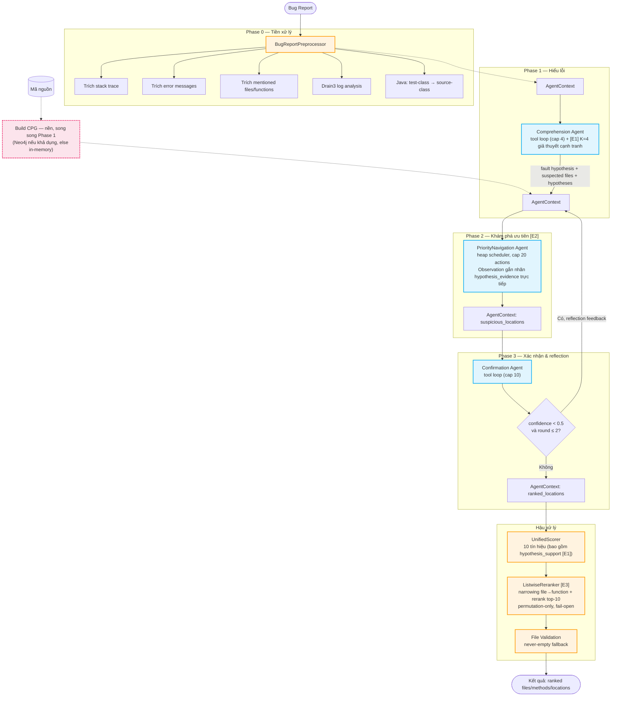
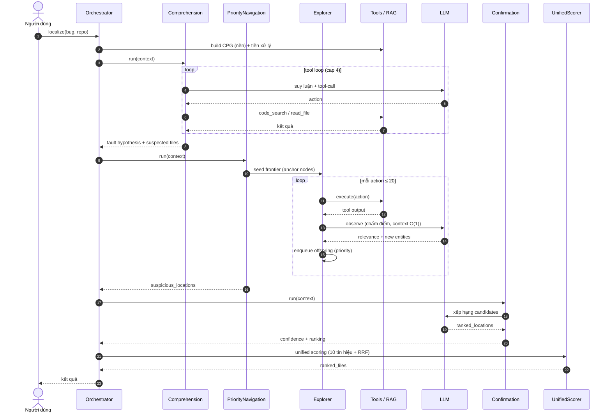
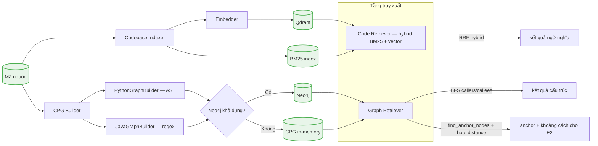

# Chương 3. Kiến trúc Hệ thống

> Tài liệu kiến trúc phục vụ trình bày trong luận văn. Sơ đồ vẽ theo tiêu chuẩn **C4 Model** (Context – Container – Component) và **System Flowchart / Sequence** bằng cú pháp Mermaid (có thể render trực tiếp hoặc xuất ảnh qua `mmdc`). Số liệu thực nghiệm và ablation xem [RESULTS_SUMMARY.md](RESULTS_SUMMARY.md).

---

## 3.1. Tổng quan

Hệ thống định vị lỗi (bug localization) được xây dựng theo mô hình **hệ đa tác tử (multi-agent) kết hợp Retrieval-Augmented Generation (RAG) và Code Property Graph (CPG)**. Đầu vào là một bug report dạng ngôn ngữ tự nhiên (kèm log/stack trace nếu có) và mã nguồn của dự án; đầu ra là danh sách xếp hạng các file/method nghi ngờ chứa lỗi, được đánh giá bằng việc file sửa lỗi thực tế (ground truth) có nằm ở vị trí cao hay không.

Hệ thống được tổ chức thành **năm lớp chức năng** (Hình 3.1):

1. **Lớp giao tiếp** (CLI / API) — tiếp nhận yêu cầu `localize`, `evaluate`, `index`.
2. **Lớp điều phối** (Orchestrator) — quản lý vòng đời tác tử, ngữ cảnh dùng chung, và các hook hậu xử lý (unified scoring, rerank, patch duel).
3. **Lớp tác tử** (Multi-Agent) — Comprehension → Navigation/Explorer → Confirmation, cùng các thành phần mở rộng E1 (giả thuyết cạnh tranh) và E2 (khám phá ưu tiên).
4. **Lớp tri thức** (RAG & CPG) — Qdrant vector store + Code Property Graph (Neo4j hoặc in-memory).
5. **Lớp công cụ** (Tools) — 16 công cụ sandbox chuẩn OpenAI tool-format, chia sẻ cache LRU.

Các tính năng mở rộng E1/E2/E3/H1 đều có công tắc cấu hình riêng, **mặc định tắt**, không thay đổi schema đầu ra nên bật/tắt độc lập — tạo cơ sở cho phần ablation (Chương 4).

---

## 3.2. Mô hình C4

### 3.2.1. C4 Level 1 — System Context (Hình 3.2)

Biểu đồ ngữ cảnh định vị hệ thống trong môi trường vận hành và các hệ thống bên ngoài.



**Diễn giải.** Người dùng chỉ cần cung cấp bug report và đường dẫn tới working copy của repository; hệ thống tự đọc mã nguồn qua lớp công cụ, gọi LLM để suy luận, và trả về danh sách xếp hạng. Toàn bộ giao tiếp với LLM tuân thủ OpenAI Chat Completions API nên có thể đổi provider (Qwen, OpenRouter, Gemini, Ollama/vLLM) mà không đổi code.

### 3.2.2. C4 Level 2 — Container (Hình 3.3)

Sáu container chính bên trong ranh giới hệ thống, cùng hai kho dữ liệu và hai hệ thống ngoài.



**Điểm thiết kế đáng chú ý.**

- **Graph DB có fallback tự động**: khi `NEO4J_ENABLED=true` nhưng kết nối thất bại, hệ thống chuyển sang CPG in-memory mà không làm sập pipeline (fail-open).
- **Vector DB và Graph DB tách rời**: semantic search và structural traversal là hai luồng độc lập, hợp nhất ở tầng reranking.
- **Explorer Engine là container riêng**: tách bộ lập lịch (xác định) khỏi LLM (chấm điểm) khiến E2 có thể unit-test mà không cần gọi API — đây là quyết định kiến trúc then chốt cho khả năng lặp lại thí nghiệm.

### 3.2.3. C4 Level 3 — Component (Hình 3.4)

Chi tiết bên trong container "Hệ đa tác tử" và "Orchestrator".

```mermaid
C4Component
    title Hình 3.4 — Component Diagram (Orchestrator + Multi-Agent)

    Container_Boundary(orch_b, "Orchestrator") {
        Component(ctx, "AgentContext", "dataclass", "Trạng thái dùng chung:\nbug_info, suspicious_files, hypotheses,\nstack_traces, suspicious_locations")
        Component(us, "UnifiedScorer", "Python", "Hợp nhất 10 tín hiệu → điểm tổng")
        Component(rf, "RankFusion (RRF)", "Python", "Đồng thuận 4 bảng xếp hạng,\n0 LLM call")
    }

    Container_Boundary(agent_b, "Hệ đa tác tử") {
        Component(comp, "Comprehension", "Agent", "Sinh fault hypothesis, [E1] K giả thuyết cạnh tranh")
        Component(nav, "Navigation", "Agent", "Khám phá codebase tự do")
        Component(pnav, "PriorityNavigation [E2]", "Agent", "Khám phá qua priority-queue, fallback về Navigation")
        Component(ver, "Verification [E1]", "Agent", "Thu bằng chứng ủng hộ/bác bỏ giả thuyết")
        Component(conf, "Confirmation", "Agent", "Xếp hạng, reflection, [H1] patch_duel")
        Component(ht, "HypothesisTracker [E1]", "Python", "Belief tracking log-odds thuần Python")
    }

    Container_Boundary(core_b, "Explorer [E2]") {
        Component(ex, "PriorityExplorer", "Python", "Heap frontier + visited dedupe")
    }

    Container_Boundary(eval_b, "Post-hoc reranking") {
        Component(rr, "ListwiseReranker [E3]", "Python", "Narrowing file→function + rerank top-K")
    }

    Rel(comp, ctx, "ghi hypothesis + candidates")
    Rel(nav, ctx, "ghi suspicious_locations")
    Rel(pnav, ctx, "ghi suspicious_locations (cùng schema)")
    Rel(pnav, ex, "dùng làm engine")
    Rel(ver, ht, "update() theo evidence")
    Rel(pnav, ht, "[E1+E2] observation gắn hypothesis_evidence")
    Rel(conf, ctx, "ghi ranked_locations")
    Rel(comp & nav & conf & ver, tools, "gọi công cụ")
    Rel(ex, tools, "thực thi action")
    Rel(ctx, us, "kết quả cuối → re-rank")
    Rel(ht, us, "file_scores() — tín hiệu thứ 10")
    Rel(us, rf, "RRF trên 4 stage ranking")
    Rel(us, rr, "evidence card → rerank top-K")
```

---

## 3.3. Luồng xử lý hệ thống

### 3.3.1. Pipeline tổng thể (Hình 3.5)

Sơ đồ dưới đây mô tả hành trình của một bug report từ tiền xử lý đến kết quả xếp hạng cuối.

Sơ đồ dưới vẽ đúng **cấu hình chuẩn / tối ưu** đã được xác nhận bằng thực nghiệm (Chương 4): E1 (giả thuyết cạnh tranh) + E2 (khám phá ưu tiên) + E3 (listwise rerank) bật, H1 (patch duel) và RRF consensus tắt (`SCORE_WEIGHT_CONSENSUS=0`, `ENABLE_PATCH_DUEL=false` — hai cơ chế này cho kết quả không có ý nghĩa thống kê trên n=300, §4.6). Vì cấu hình cố định tại thời điểm khởi chạy, các khối rẽ nhánh theo flag (`{...bật?}`) không còn xuất hiện; sơ đồ chỉ giữ lại **nhánh động thực sự phát sinh khi chạy** — vòng lặp reflection theo độ tin cậy. Một hệ quả kiến trúc quan trọng khi E2 bật: `VerificationAgent` (E1) bị bỏ qua hoàn toàn (`orchestrator.py:932`) vì Explorer đã tự gắn nhãn bằng chứng ngay trong bước `observe()` của mỗi action — không cần một tác tử xác minh riêng.



### 3.3.2. Sơ đồ tuần tự (Hình 3.6)

Minh họa tương tác theo thời gian trong một lần định vị đầy đủ, theo đúng cấu hình chuẩn (E2 bật, không có Verification riêng).



**Hai đặc trưng quan trọng của luồng.**

- **Context O(1) trong Explorer**: mỗi action của E2 gọi LLM với một prompt độc lập (không mang lịch sử hội thoại), do đó chi phí token mỗi bước không tăng tích lũy — khác hẳn tool loop tự do của Navigation.
- **Reflection loop**: khi Confirmation trả về confidence thấp, toàn bộ Phase 2–3 được chạy lại tối đa 2 lần với phản hồi định hướng (`hypothesis_tracker.reflection_summary()` khi E1 bật, hoặc feedback message chung).

---

## 3.4. Các thành phần cốt lõi

### 3.4.1. Tác tử và vòng lặp agent

Mọi tác tử kế thừa `BaseAgent` (`agents/base_agent.py`) và chạy theo mẫu **agentic loop**: LLM → tool call → LLM → … → final answer. Mỗi vòng lặp đếm là một LLM call; khi đạt `max_iterations` mà chưa ra JSON cuối, hệ thống ép tác tử trả lời (forced final answer). Bảng dưới tổng kết các tác tử, công cụ và giới hạn vòng.

| Tác tử | Vai trò | Tools đăng ký | Cap vòng (mặc định) |
|---|---|---|---|
| **Comprehension** | Sinh fault hypothesis + suspected files từ bug report | code_search, read_file, list_directory, parse_logs, search_tests | 4 |
| **Navigation** | Khám phá codebase tự do (mode gốc) | code_search, read_file, list_directory, get_file_outline, get_function_source, semantic_search, git_log, graph_search, find_callers, find_callees | 10 |
| **PriorityNavigation [E2]** | Khám phá qua heap scheduler (thay Navigation) | như Navigation + Explorer engine | 20 actions |
| **Verification [E1]** | Thu bằng chứng ủng hộ/bác bỏ K giả thuyết | code_search, read_file, find_callers, find_callees | 6 |
| **Confirmation** | Xác nhận + xếp hạng candidates, reflection | code_search, read_file, semantic_search, find_callers, find_callees | 10 |

### 3.4.2. Priority Explorer (E2)

`core/explorer.py` là bộ lập lịch khám phá kiểu OrcaLoca: một **frontier** (heap ưu tiên) các action, mỗi action được thực thi qua tool registry rồi chấm điểm bởi LLM. LLM chỉ đóng vai trò observer (chấm relevance), scheduler tự quyết định thứ tự khám phá — tách bạch "quyết định đi đâu" (xác định, thuần Python) khỏi "hiểu gì" (LLM).

Công thức ưu tiên kết hợp ba số hạng:

$$
\text{priority}(t) = w_{\text{llm}} \cdot \frac{\text{rel}(t)}{10} + w_{\text{graph}} \cdot \text{graph}(t) + w_{\text{signal}} \cdot \text{prior}(t)
$$

Các hằng số điều khiển dừng: `EARLY_SUCCESS` (8 finding có relevance ≥ 8 → dừng sớm), `STAGNATION` (5 quan sát kém liên tiếp → dừng), `MAX_FINDINGS=15`. Seed ban đầu được gán prior theo nguồn: stack trace (1.0) > mentioned (0.7) > hypothesis (0.6) > path-keyword (0.4) > default (0.2).

### 3.4.3. Unified Scorer và hợp nhất đa tín hiệu

Sau khi các tác tử chạy xong, `UnifiedScorer` (`evaluation/unified_scorer.py`) tính điểm tổng cho mỗi file ứng viên bằng tổng có trọng số của **10 tín hiệu**:

| Tín hiệu | Trọng số mặc định | Ý nghĩa |
|---|---|---|
| LLM confidence | 1.0 | Độ tin cậy do Confirmation gán |
| Stack trace (position-decay 0.85) | 2.5 | File trong stack trace, càng gần đỉnh càng cao |
| Error message match | 1.5 | Khớp thông báo lỗi trong nội dung file |
| Mentioned file | 1.2 | File được nhắc trong bug report |
| Graph proximity | 0.8 | Khoảng cách CPG tới anchor nodes |
| Semantic similarity | 0.6 | Độ giống vector ngữ nghĩa |
| Method count boost | 0.3 | Số method nghi ngờ tập trung trong file |
| Git recency (half-life 90 ngày) | 0.5 | File thay đổi gần đây |
| Hypothesis support [E1] | 0.8 | Posterior ước lượng từ tracker |
| Rank consensus (RRF) | 1.0 | Đồng thuận 4 bảng xếp hạng — 0 LLM call |

Tín hiệu `test_file_penalty` (0.5) trừ điểm file test trừ khi lỗi rõ ràng trong test setup.

### 3.4.4. Listwise Reranker (E3) và Patch Duel (H1)

- **ListwiseReranker** (`evaluation/reranker.py`): dựng "evidence card" cho top-K file (chỉ mang tín hiệu định tính, **không** mang điểm tổng hay thứ hạng hiện tại để tránh anchoring), rồi một LLM call xếp lại top-K. Hoạt động **permutation-only** — không đổi thành viên pool, nên Top-10/recall bất biến theo thiết kế.
- **Patch Duel** (`agents/confirmation.py`): một LLM call cuối, phác thảo patch cụ thể cho #1 và #2 (nhãn A/B theo alphabet, giấu thứ hạng), rồi chọn file patch thật sự sẽ sửa. Chỉ swap #1↔#2 khi B thắng, fail-open mọi lỗi.

---

## 3.5. Lớp tri thức: RAG và Code Property Graph



**Vector store là Qdrant** (collection `codebase`, khoảng cách cosine), embedding bằng `jinaai/jina-embeddings-v3`. `CodeRetriever` hỗ trợ retrieval kết hợp (hybrid): BM25 (khớp từ vựng chính xác) hợp nhất với semantic vector search bằng Reciprocal Rank Fusion (k=60) — cùng cơ chế RRF dùng cho hợp nhất stage ranking ở UnifiedScorer.

**Code Property Graph** nắm bắt năm loại thực thể và quan hệ: hàm, lớp, quan hệ chứa (contain), import, gọi (invoke), và kế thừa (inherit). `PythonGraphBuilder` dựng đồ thị bằng phân tích AST chính xác; `JavaGraphBuilder` dùng regex (kém chính xác hơn, nên trọng số graph của Java thấp hơn — `exploration_w_graph_java=0.15` vs Python `0.3`).

`GraphRetriever` kết hợp **keyword anchor matching** (tìm node theo tên trong bug report) với **BFS expansion** (lan truyền dọc caller/callee) — đây là cơ chế giúp hệ thống định vị được file sửa lỗi **không được nhắc trực tiếp** trong report (lỗi lan truyền qua call chain), đáp ứng giả thuyết H2. Khi E2 bật, graph retriever cung cấp thêm hai API cho priority scheduler: `find_anchor_nodes()` (node hạt giống) và `file_hop_distances()` (multi-source BFS, cache LRU 2048) — số hạng `graph_term = 1/(1+distance)` trong công thức priority.

---

## 3.6. Cấu hình và khả năng mở rộng

Toàn bộ cấu hình tập trung trong `config.py` dưới dạng dataclass đọc từ biến môi trường (`.env`), chia thành `LLMConfig`, `EmbeddingConfig`, `RAGConfig`, `Neo4jConfig`, `ScoringConfig` và các flag E1/E2/E3/H1. Bảng dưới liệt kê các công tắc mở rộng quan trọng.

| Flag | Mặc định | Tác dụng khi bật |
|---|---|---|
| `ENABLE_GRAPH_RAG` | true | Dùng CPG (Neo4j/in-memory) cho navigation |
| `ENABLE_HYPOTHESIS_LOOP` (E1) | false | K giả thuyết cạnh tranh + Verification + belief tracking |
| `ENABLE_PRIORITY_EXPLORATION` (E2) | false | PriorityNavigation thay Navigation |
| `ENABLE_LISTWISE_RERANK` (E3) | false | Listwise rerank top-K |
| `ENABLE_HIERARCHICAL_NARROWING` (E3) | false | Thu hẹp file → function |
| `CONFIRMATION_MODE` | loop | loop / single / hybrid |
| `ENABLE_PATCH_DUEL` (H1) | false | Duel #1 vs #2 |
| `SCORE_WEIGHT_CONSENSUS` | 1.0 | Trọng số RRF consensus (0 = tắt) |

**Khả năng mở rộng.** Thiết kế tách bạch (i) scheduler khỏi LLM (Explorer), (ii) tín hiệu xếp hạng khỏi tác tử (UnifiedScorer), và (iii) backend tri thức khỏi logic (Qdrant/Neo4j có thể thay thế) cho phép thêm tín hiệu, đổi backbone LLM, hoặc đổi graph backend mà không động tới luồng chính. Cơ chế retry hai lớp (SDK `max_retries` + wrapper backoff ở cấp call, và `INSTANCE_MAX_RETRIES` ở cấp instance) đảm bảo độ bền với lỗi mạng khi chạy benchmark quy mô lớn.

---

## 3.7. Kết luận chương

Chương này đã trình bày kiến trúc hệ thống theo bốn góc nhìn bổ sung nhau: (1) **ngữ cảnh** định vị hệ thống trong môi trường bên ngoài, (2) **container** phân chia các đơn vị triển khai, (3) **component** bóc tách bên trong lớp tác tử, và (4) **luồng xử lý** theo pipeline và theo thời gian. Kiến trúc đa tác tử + RAG + CPG, cùng các cơ chế mở rộng E1/E2/E3/H1 có thể bật/tắt độc lập, tạo cơ sở cho phần đánh giá và ablation ở Chương 4. Đặc trưng thiết kế then chốt — tách scheduler khỏi LLM, hợp nhất đa tín hiệu ở hậu xử lý, fallback tự động cho graph backend — vừa đảm bảo khả năng lặp lại thí nghiệm, vừa để lại không gian mở rộng cho hướng nghiên cứu tiếp theo.
