<!-- _class: lead -->
<!-- _paginate: false -->

# Định vị lỗi mã nguồn bằng Hệ đa tác tử LLM

## Kết hợp RAG và Code Property Graph (CPG)

### Định vị file / method chứa lỗi từ bug report ngôn ngữ tự nhiên

&nbsp;

Luận văn · Seminar trình bày 2026

<!--
Ghi chú người nói: Chào các anh/chị/cô/thầy. Hôm nay em xin trình bày đề tài "Định vị lỗi mã nguồn bằng hệ đa tác tử LLM kết hợp RAG và Code Property Graph". Bài toán cốt lõi: cho một bug report bằng ngôn ngữ tự nhiên, hãy tìm ra file/method trong mã nguồn chứa lỗi. Em sẽ đi từ động lực, qua kiến trúc hệ thống (3 tác tử + RAG + CPG), đến kết quả thực nghiệm trên benchmark SWE-bench (300 instance) với Top-1 đạt 78%. Phần quan trọng nhất là chứng minh giá trị gia tăng của khung multi-agent so với bare-LLM — một câu hỏi mà cộng đồng vẫn còn tranh cãi.
-->

---

<!-- _class: lead -->
<!-- _paginate: false -->

# Lộ trình trình bày

&nbsp;

**I.** Giới thiệu & động lực
**II.** Cơ sở lý thuyết & công trình liên quan
**III.** Kiến trúc hệ thống
**IV.** Đóng góp phương pháp (E1 / E2 / E3)
**V.** Thiết lập thí nghiệm
**VI.** Kết quả & phân tích
**VII.** Thảo luận & kết luận

<!--
Ghi chú người nói: Trình bày gồm 7 phần. Em sẽ dành nhiều thời gian nhất cho phần III (kiến trúc) và phần VI (kết quả). Đặc biệt phần ablation có một kết luận khá quan trọng: vòng lặp agent không thể nén được bằng các kỹ thuật single-pass. Mời các anh/chị theo dõi.
-->

---

<!-- _class: section -->
<!-- _paginate: false -->

# Phần I

## Giới thiệu & động lực

<!--
Ghi chú người nói: Bắt đầu phần giới thiệu. Em sẽ nói về vì sao bug localization là bài toán quan trọng và khó, và cách tiếp cận truyền thống gặp bottleneck ở đâu.
-->

---

# Bối cảnh: Bug localization là gì?

**Định vị lỗi (Bug / Fault Localization)** — nhận bug report + mã nguồn, trả về các vị trí (file/method) nghi ngờ chứa lỗi, theo thứ tự khả năng.

> *"Debugging chiếm 30–50% tổng thời gian phát triển phần mềm, và phần lớn thời gian đó dành cho việc **tìm vị trí** lỗi chứ không phải sửa nó."*

**Hai thách thức cốt lõi:**

- **Bug report mơ hồ** — ngôn ngữ tự nhiên, thiếu chính xác, đôi khi sai.
- **Codebase lớn & phức tạp** — lỗi thường nằm **không** ở file được nhắc đến, mà lan truyền qua chuỗi gọi hàm (call chain).

**Hệ quả:** con người phải duyệt hàng trăm file → tốn thời gian, phụ thuộc kinh nghiệm, dễ bỏ sót.

<!--
Ghi chú người nói: Định vị lỗi là bước đầu tiên và tốn kém nhất trong khâu sửa lỗi. Hai thách thức chính là bug report mơ hồ và codebase lớn. Điểm tinh tế: file cần sửa thường KHÔNG phải file được nhắc trong bug report — lỗi có thể lan truyền qua chuỗi gọi hàm. Đây chính là động lực để em thiết kế cơ chế Code Property Graph + graph traversal, giúp truy dấu lỗi qua cấu trúc gọi hàm chứ không chỉ khớp từ khóa.
-->

---

# Động lực: Quy trình truyền thống gặp bottleneck

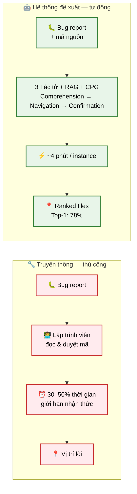

**Truyền thống (thủ công):**
- Lập trình viên đọc bug report
- Duyệt mã nguồn bằng từ khóa, grep, kinh nghiệm
- **Bottleneck:** 30–50% thời gian, giới hạn nhận thức con người

**Hệ thống đề xuất (tự động):**
- Đầu vào: bug report + đường dẫn repo
- 3 tác tử LLM + RAG + CPG
- ~4 phút / instance → **Top-1: 78%**

**Mục tiêu:** phục hồi có hệ thống vị trí lỗi, đặc biệt ở các case **ngoài tri thức ghi nhớ** của LLM.

<!--
Ghi chú người nói: Bên trái là quy trình thủ công — bottleneck rõ ràng ở bước duyệt mã nguồn. Bên phải là hệ thống đề xuất: tự động, ~4 phút cho một instance. Nhưng em nhấn mạnh: mục tiêu KHÔNG chỉ là "đúng hơn một chút". Mục tiêu sâu xa hơn là phục hồi có hệ thống các case mà LLM không "nhớ" — tức là bug nằm ngoài tập huấn luyện. Phần case study sẽ làm rõ điểm này.
-->

---

# Câu hỏi nghiên cứu & đóng góp

**RQ chính:** Một hệ đa tác tử LLM (với RAG + CPG) có tạo ra giá trị định vị *thực sự* so với bare-LLM không — hay chỉ đắt hơn mà không đúng hơn?

**3 đóng góp của luận văn:**

1. **E1 — Vòng lặp giả thuyết cạnh tranh:** sinh K giả thuyết lỗi, theo dõi niềm tin (belief tracking) bằng log-odds thuần Python.
2. **E2 — Khám phá ưu tiên (priority exploration):** tách bộ lập lịch (Python) khỏi LLM (chỉ chấm điểm), context O(1) mỗi bước.
3. **E3 — Listwise rerank:** thu hẹp file→function + xếp lại top-K bằng 1 LLM call.

**Cơ sở thực nghiệm:** đánh giá đầy đủ trên **SWE-bench Lite, n=300**, so sánh paired với bare-LLM.

<!--
Ghi chú người nói: Đây là câu hỏi nghiên cứu trọng tâm — và cũng là câu hỏi gây tranh cãi trong cộng đồng: liệu agent có thực sự đáng giá so với một LLM gọi một lần? Em trả lời bằng 3 đóng góp phương pháp E1/E2/E3, được đánh giá nghiêm ngặt trên 300 instance với kiểm định thống kê paired. Kết luận trước: có, +14 điểm Top-1 với p = 1.4×10⁻⁶. Chi tiết ở phần kết quả.
-->

---

<!-- _class: section -->
<!-- _paginate: false -->

# Phần II

## Cơ sở lý thuyết & công trình liên quan

<!--
Ghi chú người nói: Phần này em tóm tắt nền tảng lý thuyết và các công trình đi trước, để đặt hệ thống vào bối cảnh nghiên cứu.
-->

---

# Các hướng tiếp cận định vị lỗi

| Hướng | Đại diện | Đặc trưng | Hạn chế |
|---|---|---|---|
| **IR-based** | BugLocator, BLIA, BRTracer | Khớp từ vựng bug report ↔ mã nguồn (VSM, BM25) | Mù ngữ nghĩa; bỏ qua quan hệ cấu trúc |
| **Learning-based** | CNN, DeepRL, FastCode | Học nhúng kết hợp từ vựng + ngữ nghĩa | Cần dữ liệu huấn luyện; khó chuyển domain |
| **Agentic (LLM)** | LocAgent, BLAgent, Agentless, **hệ thống đề xuất** | LLM suy luận nhiều bước + công cụ + RAG | Chi phí cao; cần chứng minh giá trị |

&nbsp;

**Hướng agentic** đang nổi — tận dụng khả năng suy luận của LLM, nhưng đặt câu hỏi: *đáng giá không?* → luận văn trả lời bằng thực nghiệm.

<!--
Ghi chú người nói: Có 3 hướng chính. Hướng IR cổ điển khớp từ vựng — nhanh nhưng mù ngữ nghĩa và bỏ qua cấu trúc. Hướng học sâu cần dữ liệu huấn luyện. Hướng agentic dùng LLM là hướng mới và cũng là hướng của đề tài. Điểm yếu chung được nhắc nhiều là chi phí cao. Luận văn đóng góp việc đo lường nghiêm ngặt xem chi phí đó có đổi lại giá trị không.
-->

---

# Nền tảng kỹ thuật

- **LLM (Large Language Model):** mô hình ngôn ngữ lớn, suy luận qua prompt + tool-call. Đề tài dùng **qwen-plus** (Alibaba DashScope), giao tiếp chuẩn OpenAI → đổi provider được (OpenRouter, Gemini, Ollama/vLLM).

- **RAG (Retrieval-Augmented Generation):** bổ sung ngữ cảnh truy xuất (vector + BM25) vào prompt → giảm ảo giác, làm việc trên repo riêng.

- **Multi-Agent:** tách nhiệm vụ phức tạp thành nhiều tác tử chuyên biệt, mỗi tác tử có tool loop riêng → suy luận có cấu trúc.

- **Code Property Graph (CPG):** đồ thị AST + quan hệ gọi hàm/kế thừa/import → truy xuất cấu trúc, định vị lỗi lan truyền qua call chain.

<!--
Ghi chú người nói: 4 nền tảng kỹ thuật. Điểm đáng chú ý: giao tiếp chuẩn OpenAI nên đổi provider được mà không sửa code — đây là quyết định thiết kế quan trọng cho khả năng lặp lại thí nghiệm. Và CPG là phần khác biệt so với các hệ thống chỉ dùng RAG vector — CPG cho phép truy dấu lỗi theo cấu trúc gọi hàm.
-->

---

# Công trình liên quan (SOTA file-level)

| Hệ thống | Backbone | Top-1 | Đặc trưng |
|---|---|---:|---|
| **LocAgent** | Claude-3.5 | 77.7 | Graph-guided agent, nhiều công cụ |
| **BLAgent** | GPT-OSS-120B | 78.6 | Agentic RAG |
| Agentless | GPT-4o | 63.0 | Hai giai đoạn, không agent |
| CoSIL | Qwen2.5-32B | 61.3 | Iterative code graph search |

**Khoảng trống nghiên cứu:**

- Phần lớn báo cáo Top-1 mà **không so baseline bare-LLM cô lập** → khó quy trách giá trị cho agent.
- Ít hệ thống tách bạch **bộ lập lịch** khỏi LLM (chi phí tích lũy context).
- Thiếu **phân tích autopsy** case thất bại → khó biết cải thiện ở đâu.

<!--
Ghi chú người nói: Đây là các hệ thống SOTA trên cùng benchmark SWE-bench Lite, file-level. Em rút ra 3 khoảng trống nghiên cứu: thứ nhất, phần lớn không so với bare-LLM cô lập nên không rõ phần đóng góp là từ agent hay từ backbone mạnh; thứ hai, ít hệ thống tách scheduler khỏi LLM; thứ ba, thiếu phân tích autopsy. Luận văn lấp cả 3 khoảng trống này.
-->

---

<!-- _class: section -->
<!-- _paginate: false -->

# Phần III

## Kiến trúc hệ thống

<!--
Ghi chú người nói: Đây là phần trọng tâm. Em trình bày kiến trúc theo 4 góc nhìn bổ sung nhau: tổng quan, C4 (ngữ cảnh–container–component), luồng xử lý, và chi tiết các thành phần.
-->

---

# Tổng quan kiến trúc — 5 lớp chức năng

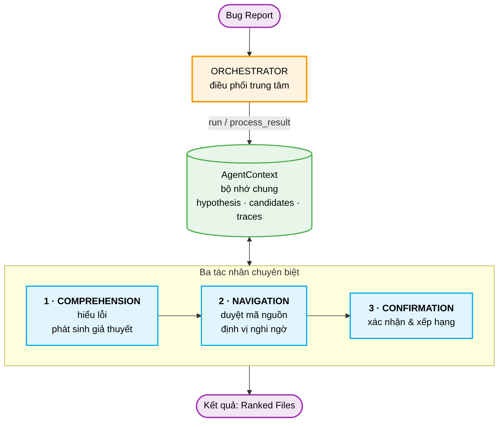

1. **Giao tiếp** (CLI / FastAPI) — `localize`, `evaluate`, `index`
2. **Điều phối** (Orchestrator) — vòng đời tác tử, context chung, hook hậu xử lý
3. **Tác tử** (Multi-Agent) — Comprehension → Navigation/Explorer → Confirmation + E1/E2
4. **Tri thức** (RAG & CPG) — Qdrant vector store + Code Property Graph
5. **Công cụ** (Tools) — 16 công cụ sandbox, chia sẻ cache LRU

**3 đóng góp E1/E2/E3** đều có công tắc `.env` riêng, tắt mặc định, không đổi schema output → bật/tắt độc lập, tạo cơ sở cho phần **ablation** (Phần VI).

<!--
Ghi chú người nói: 5 lớp chức năng. Yếu tố then chốt về thiết kế: các tính năng E1/E2/E3 được tách thành công tắc độc lập, mặc định tắt, không đổi schema đầu ra. Điều này cho phép em làm ablation nghiêm ngặt — bật/tắt từng cái để đo tác động, mà không ảnh hưởng phần còn lại.
-->

---

# C4 Level 1 — System Context

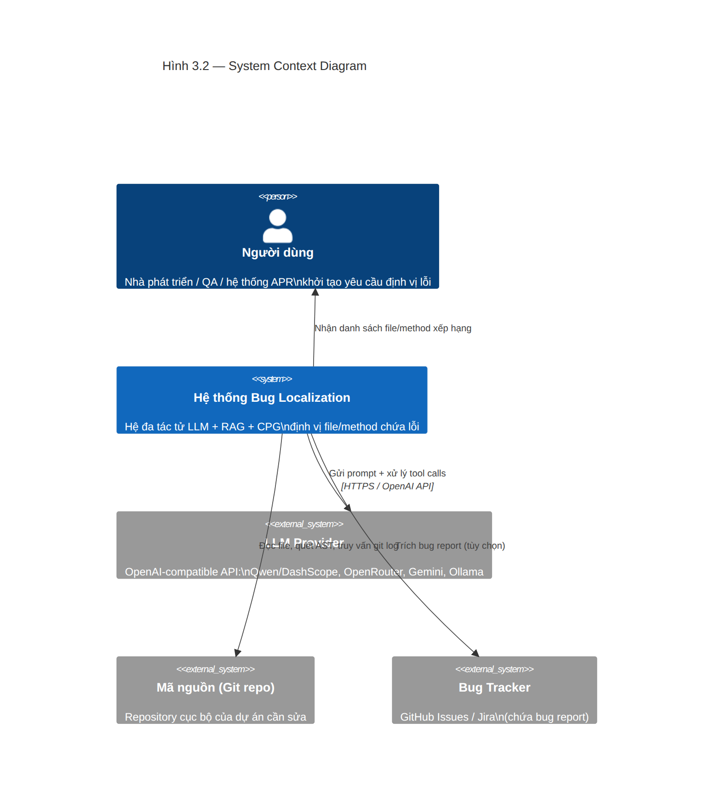

<!--
Ghi chú người nói: Biểu đồ ngữ cảnh định vị hệ thống trong môi trường. Người dùng chỉ cần cung cấp bug report và đường dẫn repo. Hệ thống tự đọc mã nguồn qua lớp công cụ, gọi LLM để suy luận, trả về danh sách xếp hạng. Toàn bộ giao tiếp LLM tuân thủ OpenAI API nên đổi provider dễ dàng. LLM Provider, mã nguồn (Git), và Bug Tracker là 3 hệ thống ngoài.
-->

---

# C4 Level 2 — Container

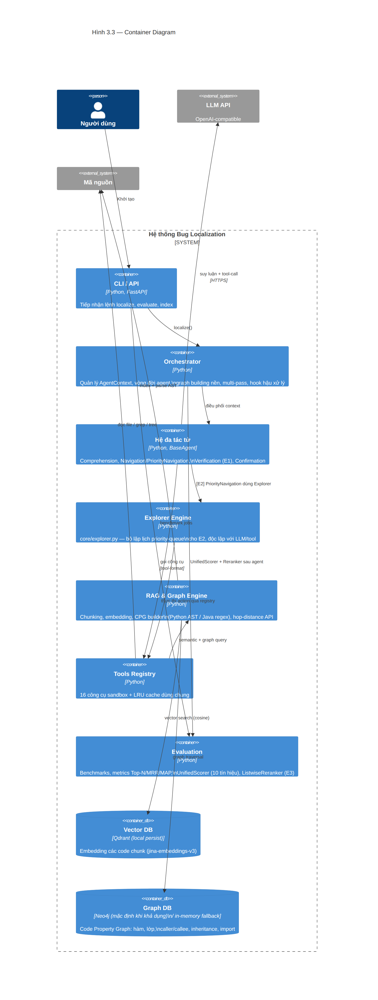

<!--
Ghi chú người nói: 7 container chính. Ba điểm thiết kế quan trọng: thứ nhất, Graph DB có fallback tự động — nếu Neo4j kết nối lỗi thì chuyển sang CPG in-memory mà không sập pipeline; thứ hai, Vector DB và Graph DB tách rời — semantic search và structural traversal là hai luồng độc lập, hợp nhất ở tầng reranking; thứ ba, Explorer Engine là container riêng — tách bộ lập lịch khỏi LLM khiến E2 unit-test được mà không cần gọi API.
-->

---

# C4 Level 3 — Component

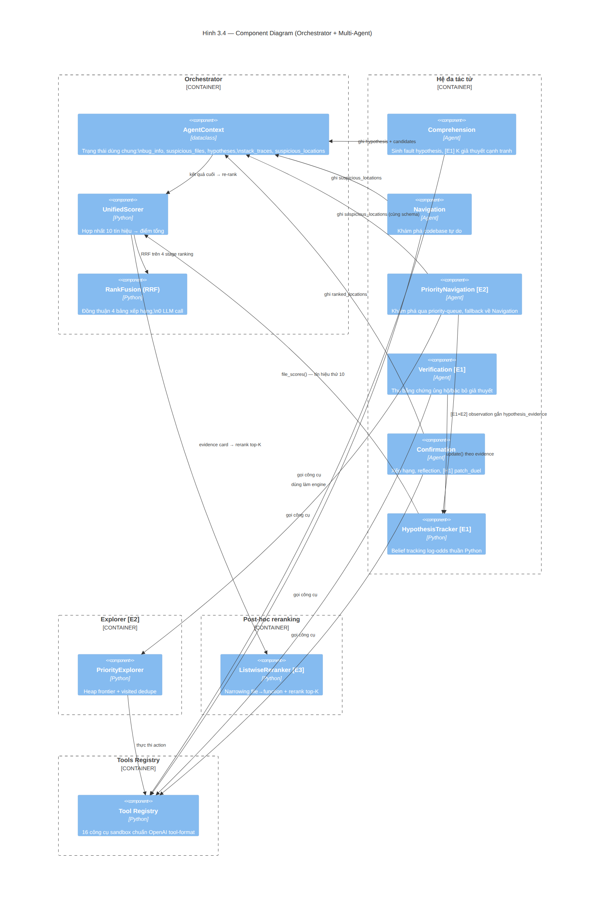

<!--
Ghi chú người nói: Đây là component diagram bên trong container Hệ đa tác tử. Em muốn highlight: AgentContext là bộ nhớ chung (dataclass), HypothesisTracker làm belief tracking thuần Python — LLM chỉ gắn nhãn bằng chứng, không tự cập nhật niềm tin. Và PriorityExplorer trong core_b là engine độc lập, agnostic với LLM/tool, có thể unit-test riêng.
-->

---

# Luồng xử lý tổng thể (Pipeline)

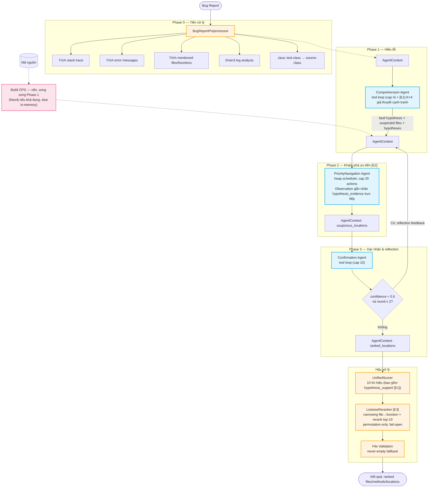

<!--
Ghi chú người nói: Đây là sơ đồ pipeline theo cấu hình chuẩn đã được thực nghiệm xác nhận: E1, E2, E3 bật; H1 patch duel và RRF consensus tắt (sẽ giải thích ở phần kết quả vì sao tắt). Lưu ý: vì E2 bật, VerificationAgent bị bỏ qua hoàn toàn — Explorer đã tự gắn nhãn bằng chứng ngay trong bước observe. Vòng lặp reflection duy nhất còn lại chạy khi confidence < 0.5, tối đa 2 lần.
-->

---

# Sơ đồ tuần tự (Sequence)

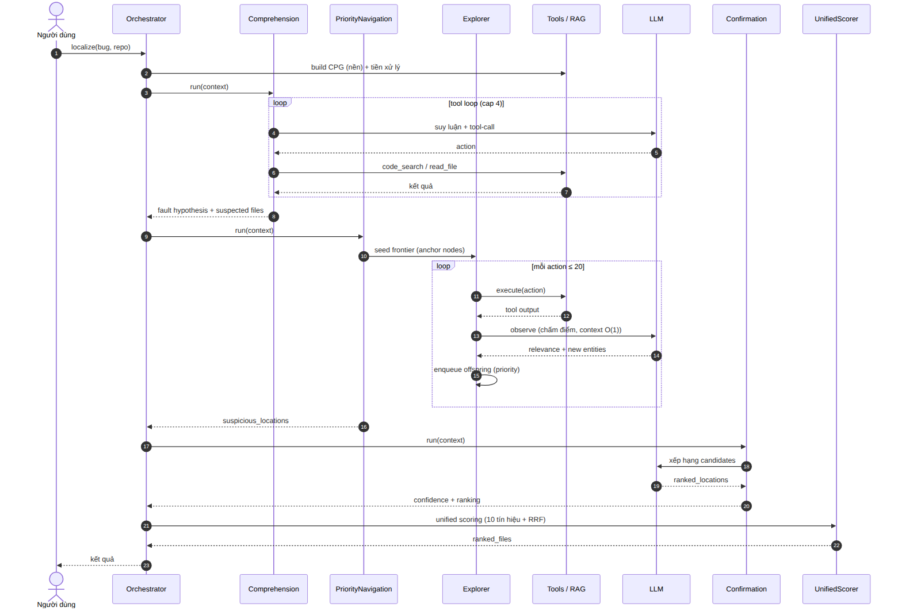

<!--
Ghi chú người nói: Sơ đồ tương tác theo thời gian. Hai đặc trưng quan trọng: thứ nhất, context O(1) trong Explorer — mỗi action gọi LLM với prompt độc lập, không mang lịch sử, nên chi phí token không tích lũy; thứ hai, reflection loop — khi Confirmation trả confidence thấp, toàn bộ Phase 2-3 được chạy lại tối đa 2 lần với phản hồi định hướng từ HypothesisTracker.
-->

---

# Ba tác tử chuyên biệt

| Tác tử | Vai trò | Tools chính | Cap |
|---|---|---|---:|
| **1. Comprehension** | Hiểu lỗi → sinh fault hypothesis + suspected files | code_search, read_file, list_directory, parse_logs | 4 |
| **2. PriorityNavigation [E2]** | Khám phá qua heap scheduler; LLM chỉ chấm điểm | + semantic_search, graph_search, find_callers/callees | 20 |
| **3. Confirmation** | Xác nhận + xếp hạng candidates, reflection | code_search, read_file, find_callers/callees | 10 |

Mọi tác tử kế thừa `BaseAgent`, chạy **agentic loop**: LLM → tool call → LLM → … → JSON cuối. Đạt `max_iterations` mà chưa ra → ép trả lời (forced final answer).

<!--
Ghi chú người nói: Ba tác tử chuyên biệt, mỗi cái một vai trò rõ ràng. Điểm khác biệt so với nhiều hệ thống agent khác: Comprehension có cap thấp (4) vì chỉ cần sinh hypothesis; PriorityNavigation có cap cao (20) vì khám phá là phần tốn kém; Confirmation ở giữa (10) cho xác minh. Cap khác nhau phản ánh bản chất nhiệm vụ khác nhau.
-->

---

# E2 Priority Explorer — công thức ưu tiên

**Ý tưởng OrcaLoca:** một *frontier* (heap ưu tiên) các action; LLM chỉ chấm điểm relevance, scheduler tự quyết định thứ tự.

→ Tách **"quyết định đi đâu"** (Python, xác định) khỏi **"hiểu gì"** (LLM).

**priority(t) = w_llm · rel(t)/10 &nbsp;+&nbsp; w_graph · graph(t) &nbsp;+&nbsp; w_signal · prior(t)**

**Seed theo nguồn:** stack trace (1.0) &gt; mentioned (0.7) &gt; hypothesis (0.6) &gt; keyword (0.4)

**Dừng:** `EARLY_SUCCESS` (≥8 finding relevance≥8) · `STAGNATION` (5 quan sát kém liên tiếp) · `MAX_FINDINGS=15`

**Graph term:** `graph(t) = 1 / (1 + distance)` — distance từ multi-source BFS (cache LRU 2048).

<!--
Ghi chú người nói: Đây là đóng góp E2. Công thức priority kết hợp 3 số hạng: relevance do LLM, graph distance từ CPG, và prior signal. Ý tưởng then chốt là tách scheduler khỏi LLM — LLM chỉ chấm điểm, Python quyết định thứ tự khám phá. Lợi thế: mỗi bước dùng context O(1) vì prompt độc lập, nên chi phí token không tăng tích lũy. Đây là khác biệt lớn so với tool loop tự do.
-->

---

# Unified Scorer — hợp nhất 10 tín hiệu

Sau khi agents chạy xong, `UnifiedScorer` cộng có trọng số **10 tín hiệu** cho mỗi file ứng viên:

| Tín hiệu | Trọng số | | Tín hiệu | Trọng số |
|---|---:|---|---|---:|
| Stack trace (decay 0.85) | 2.5 | | Git recency (half-life 90d) | 0.5 |
| Error message match | 1.5 | | Graph proximity | 0.8 |
| LLM confidence | 1.0 | | Semantic similarity | 0.6 |
| Rank consensus (RRF) | 1.0 | | Method count boost | 0.3 |
| Mentioned file | 1.2 | | **Hypothesis support [E1]** | 0.8 |

`test_file_penalty` (−0.5) trừ điểm file test trừ khi lỗi rõ ràng trong test setup.

<!--
Ghi chú người nói: Hậu xử lý hợp nhất 10 tín hiệu thành điểm tổng. Thiết kế này cho phép thêm/bớt tín hiệu dễ dàng mà không động tới agent. Tín hiệu mạnh nhất là stack trace (2.5) — đỉnh stack gần lỗi nhất. Hypothesis support từ E1 là tín hiệu thứ 10, đóng góp niềm tin từ tracker. Việc hợp nhất đa tín hiệu ở hậu xử lý là điểm linh hoạt của kiến trúc.
-->

---

# RAG & Code Property Graph

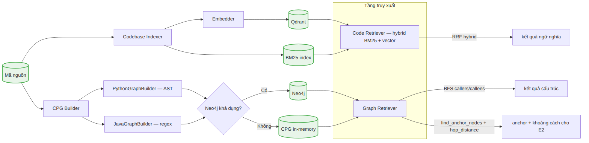

**Vector store (Qdrant):** `jina-embeddings-v3`, hybrid BM25 + semantic, hợp nhất bằng RRF (k=60).

**Code Property Graph:** 5 thực thể/quan hệ — hàm, lớp, chứa, import, gọi, kế thừa.
- `PythonGraphBuilder` — AST chính xác
- `JavaGraphBuilder` — regex (ít chính xác hơn → trọng số graph thấp hơn)

**GraphRetriever:** keyword anchor + BFS expansion → định vị file **không được nhắc** trong report (lỗi lan truyền qua call chain).

<!--
Ghi chú người nói: Lớp tri thức có 2 luồng độc lập. Vector search cho ngữ nghĩa, CPG cho cấu trúc. Điểm quan trọng: GraphRetriever kết hợp anchor matching với BFS expansion — đây là cơ chế giúp định vị file KHÔNG được nhắc trong bug report, đáp ứng lỗi lan truyền qua call chain. Đây là khác biệt cốt lõi so với hệ thống chỉ khớp từ khóa.
-->

---

<!-- _class: section -->
<!-- _paginate: false -->

# Phần IV

## Đóng góp phương pháp — E1 / E2 / E3

<!--
Ghi chú người nói: Phần này đi sâu vào 3 đóng góp. Em đã giới thiệu E2 ở slide trước (Priority Explorer), giờ tập trung E1 và tổng quan.
-->

---

# Tổng quan 3 đóng góp

| | Đóng góp | Vấn đề giải quyết | Đo lường |
|---|---|---|---|
| E1 | **Vòng lặp giả thuyết cạnh tranh** | Agent dừng sớm ở hypothesis đầu tiên, mất khả năng phân định | Top-1 discrimination |
| E2 | **Khám phá ưu tiên** | Tool loop tự do đốt context tích lũy, đắt & không hội tụ | Chi phí + recall |
| E3 | **Listwise rerank** | Pointwise scoring sai thứ tự tương đối giữa candidates | Top-1 / Top-3 |

**Triết lý chung:** tách phần *xác định* (Python, reproducible) khỏi phần *hiểu* (LLM, đắt) → giảm phụ thuộc vào LLM cho quyết định algorithmic.

<!--
Ghi chú người nói: Bảng tổng quan 3 đóng góp và vấn đề mỗi cái giải quyết. E1 giải quyết agent dừng sớm; E2 giải quyết context tích lũy; E3 giải quyết pointwise scoring. Triết lý chung: tách phần xác định (Python, tái lặp được) khỏi phần hiểu (LLM, đắt). Mọi quyết định algorithmic không nên giao cho LLM.
-->

---

# E1 Vòng lặp giả thuyết cạnh tranh + HypothesisTracker

**Vấn đề:** Agent thường cam kết sớm với fault hypothesis đầu tiên → khi có 2 file cùng subsystem, chọn sai (pattern "tầng liền kề").

**Giải pháp:**
- Sinh **K=4 giả thuyết lỗi cạnh tranh** trong Comprehension.
- `HypothesisTracker` theo dõi posterior mỗi hypothesis bằng **log-odds thuần Python** — cập nhật khi có evidence.
- LLM **chỉ gắn nhãn** bằng chứng (ủng hộ / bác bỏ / trung tính); tính toán posterior là Python.

**Tín hiệu đầu ra:** `hypothesis_support` (tín hiệu thứ 10 trong Unified Scorer) + `reflection_summary()` cho vòng lặp reflection.

Lý do không để LLM tự cập nhật niềm tin: tin cậy kém, không reproducible, và tốn LLM call thừa.

<!--
Ghi chú người nói: E1 giải quyết pattern "tầng liền kề" — ví dụ options.py vs base.py. Bằng cách sinh 4 hypothesis cạnh tranh và theo dõi posterior bằng Python, agent không cam kết sớm. Quyết định thiết kế quan trọng: LLM chỉ gắn nhãn evidence, không tự tính posterior — vì 3 lý do: tin cậy kém, không tái lặp được, và tốn call thừa.
-->

---

# E2 + E3 Khám phá ưu tiên & Listwise rerank

**E2 — PriorityNavigation** (đã trình bày): heap frontier + LLM observer. Khi E2 bật, `VerificationAgent` (E1) bị bỏ qua vì Explorer tự gắn nhãn evidence trong `observe()`. Fallback về NavigationAgent nếu tìm quá ít.

**E3 — ListwiseReranker** (`evaluation/reranker.py`):
- Dựng **evidence card** cho top-K file (chỉ tín hiệu định tính — **không** mang điểm tổng hay thứ hạng → tránh anchoring).
- 1 LLM call xếp lại top-K, **permutation-only** (không đổi thành viên pool) → Top-10 / recall bất biến theo thiết kế.
- **Fail-open:** mọi lỗi parse → giữ thứ tự cũ, không sập.

**Patch Duel (H1):** 1 LLM call cuối phác thảo patch cho #1 vs #2 (giấu thứ hạng), chọn file sửa thật. **→ đã đo n=300: KHÔNG có ý nghĩa thống kê, giữ tắt** (xem Phần VI).

<!--
Ghi chú người nói: E3 đáng chú ý ở 3 điểm thiết kế. Thứ nhất, evidence card không mang điểm số hay thứ hạng để tránh anchoring bias của LLM. Thứ hai, permutation-only nên Top-10 và recall không đổi — chỉ hoán vị thứ tự trong pool. Thứ ba, fail-open mọi lỗi. Còn Patch Duel H1 — em đã đo trên 300 instance và kết luận KHÔNG đáng bật, sẽ trình bày chi tiết ở phần kết quả.
-->

---

<!-- _class: section -->
<!-- _paginate: false -->

# Phần V

## Thiết lập thí nghiệm

<!--
Ghi chú người nói: Phần thiết lập thí nghiệm — benchmark, metric, baseline, và phương pháp kiểm định thống kê.
-->

---

# Benchmark & Metrics

**Benchmark: SWE-bench Lite** (`princeton-nlp/SWE-bench_Lite`, test split)
- **300 instance** đầu (để khớp subset cũ, so sánh apples-to-apples).
- Repo: django, sympy, sphinx, pytest, scikit-learn, pylint, flask, astropy...
- Ground truth = file sửa trong gold patch (`buggy_files`).

**Metrics (file-level):**
- **Top-1 / Top-3 / Top-5 accuracy** — file đúng có trong top-N?
- **MRR** (Mean Reciprocal Rank) — ưu tiên hạng cao.
- **MAP** (Mean Average Precision).

Dùng đúng các hàm metric của hệ thống (`top_n_accuracy`, `reciprocal_rank`, `average_precision` + chuẩn hóa `_paths_match`).

<!--
Ghi chú người nói: Benchmark SWE-bench Lite, 300 instance đầu. Ground truth là file trong gold patch. Các metric chuẩn Top-N, MRR, MAP. Em dùng đúng hàm metric của hệ thống cho cả baseline và agent để đảm bảo so sánh công bằng — đây là điểm dễ bị chỉ trích nếu dùng metric khác nhau cho hai hệ thống.
-->

---

# Baselines & kiểm định thống kê

**Bare-LLM (baseline cô lập):** 1 LLM call, không agent, không RAG, không tool — chỉ bug report + file tree → JSON xếp hạng.

| Cấu hình | Đặc trưng |
|---|---|
| **Bare-Legacy** | prompt flat zero-shot (prompt gốc) |
| **Bare-Research v1** | CoT + delimiter + constrained decoding (prompt chuẩn nghiên cứu) |
| Bare-Research v2 | v1 + ép ≥5 ứng viên |

**Backbone thống nhất:** `qwen-plus` cho cả bare và agent (1 biến đổi duy nhất = khung agent).

**Kiểm định:** **paired McNemar** trên cùng 300 instance từng cặp → p-value cho delta Top-1/Top-5.

Temperature = 0 (deterministic) cho mọi hệ thống → loại nhiễu lấy mẫu.

<!--
Ghi chú người nói: Cách em thiết kế baseline rất quan trọng cho tính thuyết phục. Bare-LLM cô lập tối đa — 1 call, không gì khác. Cùng backbone qwen-plus cho cả hai hệ thống, biến đổi duy nhất là khung agent. Kiểm định paired McNemar trên từng cặp instance. Temperature = 0 để loại nhiễu lấy mẫu. Thiết kế này khiến kết luận "+14 điểm là do agent" khó bị phản bác.
-->

---

<!-- _class: section -->
<!-- _paginate: false -->

# Phần VI

## Kết quả & phân tích

<!--
Ghi chú người nói: Đây là phần quan trọng nhất. Em sẽ đi từ kết quả headline, đến claim thống kê, baseline, chi phí, ablation, autopsy case thất bại, và kết quả âm của RRF/Patch Duel.
-->

---

# Kết quả chính (n=300)

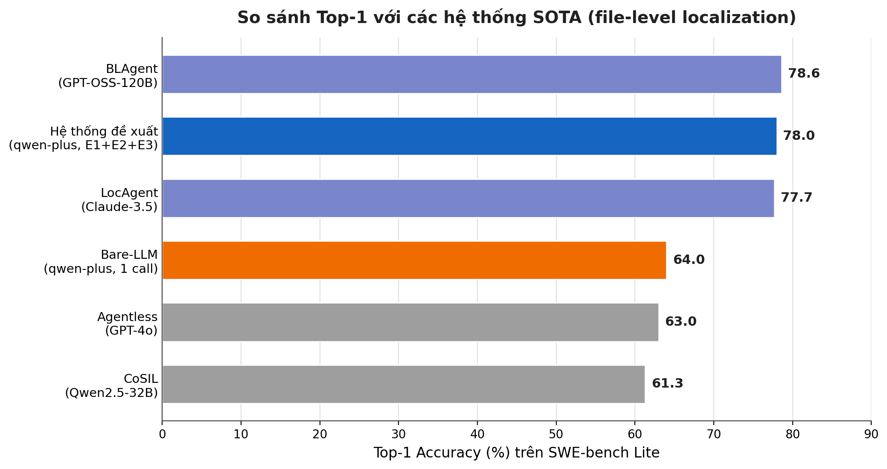

| Hệ thống | Top-1 | Top-3 | Top-5 | MRR |
|---|---:|---:|---:|---:|
| Bare-LLM (1 call) | 64.0 | 83.7 | 87.0 | 0.738 |
| **Đề xuất (E1+E2+E3)** | **78.0** | **87.3** | **89.3** | **0.829** |

**Top-1 ngang SOTA** cùng phân khúc backbone (78.0 vs LocAgent 77.7, BLAgent 78.6). Top-3/5 thấp hơn LocAgent — do LocAgent dùng backbone Claude-3.5 mạnh hơn nhiều.

<!--
Ghi chú người nói: Đây là kết quả headline. Top-1 78% ngang SOTA, dù backbone qwen-plus yếu hơn nhiều so với Claude-3.5 hay GPT-OSS-120B của các hệ thống khác. Điều này cho thấy thiết kế agent hợp lý có thể bù đắp backbone yếu hơn. Top-3/Top-5 thấp hơn LocAgent vì backbone chênh lệch — em minh bạch về điểm này.
-->

---

# Claim chính: Giá trị gia tăng của khung agent

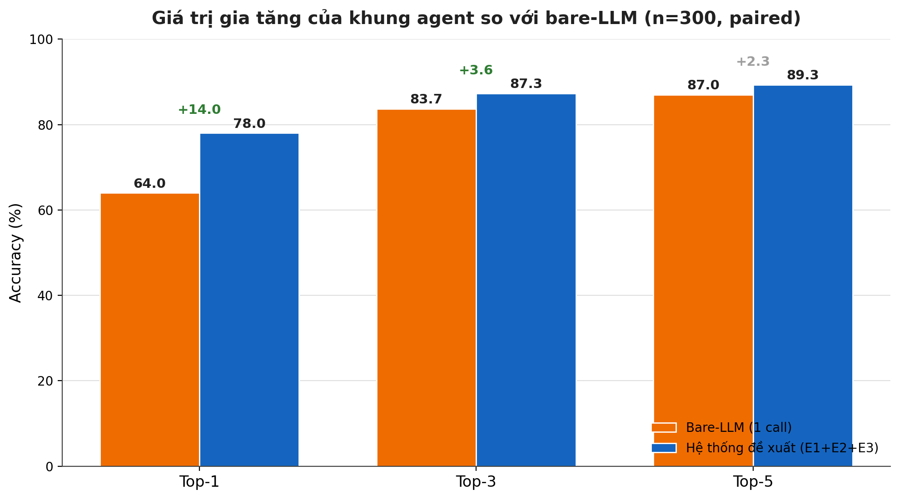

| Metric | Bare | Đề xuất | Δ | McNemar p |
|---|---:|---:|---:|---:|
| Top-1 | 64.0 | **78.0** | **+14.0** | **1.4 × 10⁻⁶** |
| Top-3 | 83.7 | 87.3 | +3.6 | — |
| Top-5 | 87.0 | 89.3 | +2.3 | 0.28 (không ý nghĩa) |

**Diễn giải:** +14 điểm Top-1, **ý nghĩa rất mạnh** (59 case agent thắng, 17 bare thắng). Top-5 không có ý nghĩa — bare-LLM đã tiếp cận giới hạn recall nhờ **ghi nhớ** các repo phổ biến trong train.

**Chi phí đổi lại:** ~34× LLM calls, ~100× thời gian.

<!--
Ghi chú người nói: Đây là claim cốt lõi, sạch thống kê. +14 điểm Top-1 với p = 1.4 phần triệu — gần như chắc chắn không phải ngẫu nhiên. 59 case agent thắng vs 17 bare thắng. Nhưng em thành thật: ở Top-5 sự cải thiện KHÔNG có ý nghĩa thống kê, vì bare-LLM đã "nhớ" nhiều repo phổ biến trong SWE-bench. Đây là bằng chứng của vấn đề memorization trên benchmark public — em sẽ nói rõ ở phần threats to validity.
-->

---

# Bare-LLM baseline — CoT có giúp không?

| Cấu hình (n=300) | Top-1 | Top-3 | Top-5 | MRR | calls |
|---|---:|---:|---:|---:|---:|
| Bare-Legacy (flat) | 64.0 | 83.7 | 87.0 | 0.738 | 1 |
| **Bare-Research v1 (CoT)** | **67.7** | 79.0 | 79.7 | 0.731 | 1 |
| Bare-Research v2 (ép ≥5) | 60.7 | 74.0 | 76.3 | 0.674 | 1 |

**2 phát hiện:**

1. **CoT đẩy Top-1 (+3.7)** nhưng lại **giảm Top-3/Top-5** — CoT làm LLM *tự tin & kén chọn* (median 2 file/inst).
2. **Ép "≥5 ứng viên" (v2) là net-negative** — giảm MỌI metric kể cả Top-5. Padding ứng viên = noise, không lấp case miss.

→ Negative result quan trọng: "under-listing" KHÔNG phải vấn đề cốt lõi; giữ v1, bỏ v2.

<!--
Ghi chú người nói: Phần này có 2 kết luận tinh tế. Thứ nhất, Chain-of-Thought không phải lúc nào cũng tốt — nó đổi precision (Top-1) lấy recall (Top-5). Thứ hai, và quan trọng hơn, ép "ít nhất 5 ứng viên" là net-negative, giảm mọi metric kể cả Top-5. Đây là negative result có giá trị: nó bác bỏ giả thuyết phổ biến rằng "chỉ cần list nhiều file hơn thì Top-5 sẽ cao hơn". Thực tế padding chỉ thêm noise.
-->

---

# Phân tích chi phí LLM (≈34.7 calls/instance)

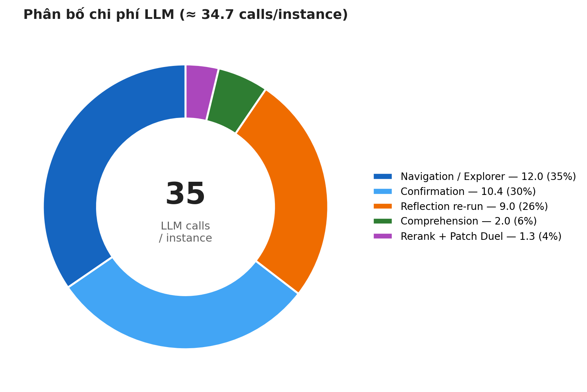

| Thành phần | calls | % |
|---|---:|---:|
| Navigation / Explorer | ~12 | 35% |
| Confirmation | ~10.4 | 30% |
| Reflection re-run | ~9 | 26% |
| Comprehension | ~2 | 6% |
| Rerank + Duel | ~1.3 | 4% |

**Phát hiện:** **57% tổng calls là "cap-hits"** (agent chạy hết vòng cho phép) — Confirmation 65%, Comprehension 87%. Đây là dấu hiệu vòng lặp đang **xác minh lặp**, không phải khám phá mới.

→ Định hướng tối ưu: nén cap verification trước.

<!--
Ghi chú người nói: Em minh bạch về chi phí: 34.7 calls/instance. Phát hiện quan trọng: 57% số calls là cap-hits — agent chạy hết vòng cho phép mà chưa ra JSON cuối. Điều này cho thấy phần lớn chi phí nằm ở xác minh lặp, KHÔNG phải khám phá mới. Đây là headroom tối ưu hóa rõ ràng — em sẽ đề xuất ở phần định hướng. Nhưng phải cẩn thận: phần ablation tiếp theo sẽ cho thấy nén vòng lặp này lại làm giảm Top-1.
-->

---

# Ablation: Vòng lặp agent KHÔNG thể nén

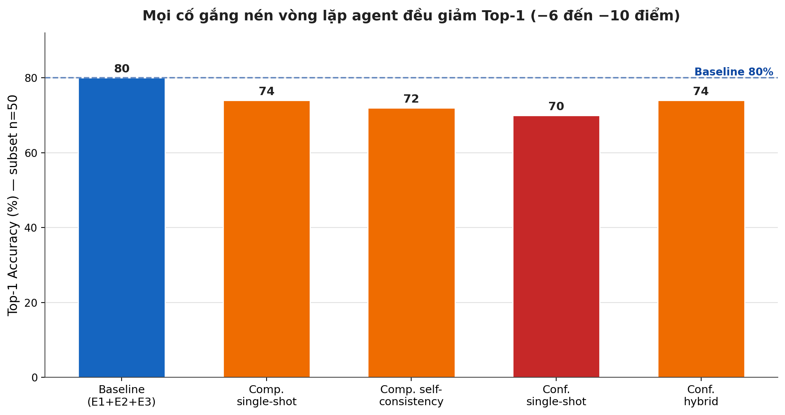

**6 thí nghiệm ablation** (n=50, paired), mọi cố gắng nén vòng lặp agent cho cùng **chữ ký thất bại**:

- Top-3 / Top-5 **giữ hoặc tăng**
- Nhưng **Top-1 giảm 5–10 điểm**
- Mất cụm theo **repo django** (kiến trúc phân tầng: file triệu chứng ≠ file cần sửa)

<b>Kết luận trần thuật chính:</b> Vòng lặp xác minh lặp đi lặp lại của agent là cơ chế <b>chuyên biệt cho Top-1 discrimination</b>, không phải cho recall. Không thay được bằng single-pass listwise.

<!--
Ghi chú người nói: Đây là kết luận quan trọng nhất của phần ablation, và cũng là một trong những đóng góp khoa học cốt lõi. Em thử 6 cách khác nhau để nén vòng lặp agent — comprehension single-shot, self-consistency, confirmation single-shot, hybrid — tất cả đều cho cùng một pattern: Top-3/Top-5 không giảm, nhưng Top-1 giảm 5-10 điểm. Ý nghĩa: vòng lặp agent không phải để recall, mà là cơ chế chuyên biệt để phân định Top-1. Đây là cái giá thật của agent, và không thể thay bằng single-pass listwise rẻ hơn.
-->

---

# Autopsy: 22% case trượt Top-1

**Cấu trúc thất bại** (trên 300 baseline):

| Bucket | Số case | % | Bản chất |
|---|---:|---:|---|
| Gold ở **rank 2–5** | 34 | 11.3% | Vấn đề **phân định** (chọn sai file cùng subsystem) |
| Gold **ngoài danh sách** | 29 | 9.7% | Vấn đề **recall** (gold không vào pool) |
| Gold ở **rank 6–10** | 3 | 1.0% | Vấn đề xếp hạng |

Trong đó **21 case có gold ở rank 2** (7%) — tiềm năng +7 điểm Top-1 nếu phân định đúng.

**Pattern phổ biến:** nhầm "tầng liền kề" cùng subsystem → `options.py` vs `base.py`, `recorder.py` vs `executor.py`.

Recall failure tập trung ở <b>sympy (13) + django (10)</b>. 3 case predicted rỗng (sphinx) — bug FileValidation drop hết path.

<!--
Ghi chú người nói: Em không chỉ báo cáo số tốt, mà còn mổ xẻ case thất bại. 22% trượt Top-1 chia làm 3 bucket. Phần lớn là vấn đề phân định (11.3%) — gold có trong top-5 nhưng không phải #1. Đặc biệt 21 case gold ở rank 2 — đây là headroom lớn nhất, +7 điểm tiềm năng nếu phân định đúng. Pattern "tầng liền kề" là cốt lõi: 2 file cùng subsystem, agent nhầm file triệu chứng với file cần sửa. Đây là vấn đề E1 nhắm tới nhưng chưa giải quyết triệt để.
-->

---

# Case study: Hai hệ thống thất bại BỔ SUNG

| Instance | GT | Agent | Bare-Research | Bare-Legacy |
|---|---|:--:|:--:|:--:|
| astropy-14365 | qdp.py | T1 | T1 | T1 |
| flask-4992 | config.py | T1 | T1 | T1 |
| pylint-5859 | misc.py | T1 | T1 | T1 |
| **django-10914** | global_settings.py | ❌ | **T1** | T5 |
| **seaborn-2848** | _oldcore.py | **T1** | ❌ | ❌ |

**`django-10914`:** LLM **đã thuộc** bug (bare T1 ngay), nhưng `listwise_rerank` của agent **làm hỏng** đáp án (rank 3→9). Pipeline tác dụng ngược trên bug đã memorize.

**`seaborn-2848`:** LLM **không thuộc** (bare sai cả 2), agent nhờ exploration + RRF **tìm ra**. Pipeline thêm giá trị thật.

⇒ Agent mạnh ở bug cần khám phá code; bare mạnh (và rẻ 25×) ở bug đã nằm trong tri thức mô hình.

<!--
Ghi chú người nói: Đây là case study minh họa rõ nhất giá trị của đề tài. Hai instance đối lập. django-10914: bug nổi tiếng, LLM đã thuộc — bare trả đúng ngay, nhưng agent lại làm hỏng vì listwise rerank đẩy hạng sai. seaborn-2848: bug nằm ngoài tri thức LLM, bare sai cả 2, nhưng agent nhờ exploration và RRF tìm ra đúng. Kết luận: hai hệ thống có failure mode bổ sung cho nhau. Đây là lý do em không nói "agent luôn tốt hơn" — em nói "agent thêm giá trị đúng chỗ: ở bug ngoài tri thức ghi nhớ".
-->

---

# RRF + Patch Duel: Kết quả ÂM trên mẫu đủ lớn

Sau khi subset n=100 cho tín hiệu tích cực (+6đ), kiểm chứng trên **đầy đủ n=300**:

| Metric | Baseline | RRF + Patch Duel | Δ | paired p |
|---|---:|---:|---:|---:|
| Top-1 | 78.0 | 76.3 | −1.7 | 0.55 (nhiễu) |
| Top-3 | 87.3 | 85.3 | −2.0 | 0.39 (nhiễu) |
| Top-5 | 89.3 | 89.3 | 0 | 1.00 |

**Kết quả: NULL.** Cải thiện trên subset 100 là **selection bias** + nhiễu LLM, không tổng quát hóa.

**Attribution Patch Duel (n=300):** swap đúng:sai = **1.8:1** (không phải 3:1 như subset từng báo). Net +4 từ Duel, nhưng RRF đánh đổi mất ~5 → tổng ≈ 0.

→ Giữ H1 và RRF <b>dưới flag, tắt mặc định</b>. Minh bạch về negative result.

<!--
Ghi chú người nói: Đây là ví dụ về tính nghiêm ngặt của thực nghiệm. Trên subset 100 instance, RRF + Patch Duel có vẻ cải thiện +6 điểm. Nhưng khi kiểm chứng trên đủ 300, kết quả là NULL — nằm trong vùng nhiễu, thực tế hơi âm. Em quy cho selection bias: subset tình cờ chứa nhiều case rank-2 mà Duel thắng. Đây là bài học về kích thẫu mẫu và là lý do em giữ hai cơ chế này tắt mặc định. Em báo cáo trung thực negative result chứ không giấu.
-->

---

<!-- _class: section -->
<!-- _paginate: false -->

# Phần VII

## Thảo luận & kết luận

<!--
Ghi chú người nói: Phần cuối — threats to validity, định hướng, đóng góp và kết luận.
-->

---

# Threats to validity (Hạn chế)

| Hạn chế | Tác động | Hướng xử lý |
|---|---|---|
| **Memorization** trên benchmark public | Bare Top-1 là *cận trên* (trùng ghi nhớ) | Nghiên cứu cross-model contamination (đang chờ API key) |
| **Confound legacy** (script cũ) | A/B chưa hoàn toàn 1-biến | Re-run legacy bằng script mới |
| **300 instance đầu** (không random) | Có thể thiên lệch theo repo | Mở rộng toàn split + per-repo breakdown |
| **qwen-plus đơn model** | Chưa rõ transfer prompt | Ablation cross-model (Qwen2.5-7B, Gemini) |
| Backbone chênh lệch vs SOTA | So sánh không hoàn toàn công bằng | Minh bạch trong báo cáo |

Đặc biệt quan trọng: bare-LLM "biết" nhiều bug từ train → 64% Top-1 của bare <b>không đo thuần khả năng suy luận</b>. Điều này càng làm nổi bật giá trị agent (thêm đúng chỗ ngoài ghi nhớ).

<!--
Ghi chú người nói: Em minh bạch về 5 hạn chế. Quan trọng nhất là memorization: SWE-bench là benchmark public, bare-LLM có thể đã "thuộc" nhiều bug trong train. Vì vậy 64% Top-1 của bare là cận trên của khả năng suy luận thuần, không phải đo thuần. Nghịch lý: hạn chế này lại CỦNG CỔ kết luận của em — vì nếu bare đã lợi thế từ ghi nhớ mà vẫn thua agent 14 điểm, thì giá trị thật của agent còn lớn hơn con số bề ngoài.
-->

---

# Định hướng phát triển (Headroom)

Theo autopsy, 2 hướng cải thiện khả thi nhất chưa khai thác:

**1. Tầng recall** (29 case gold không vào pool, +10 điểm tiềm năng) ⭐ khả thi nhất
- BM25 + query augmentation (FastCode-style)
- Mở rộng pool ứng viên trước khi rerank

**2. Phân định "tầng liền kề"** (21 case rank-2, +7 điểm)
- Cơ chế hiểu "file nào patch sẽ sửa" mạnh hơn Patch Duel 1-call
- Multi-round repair simulation

**3. Tối ưu chi phí** — nén cap-hits (57% calls) mà không hại Top-1 (khó, theo ablation).

Cross-model contamination study đang chờ <code>OPENROUTER_API_KEY</code> để đo mức độ ghi nhớ chéo mô hình.

<!--
Ghi chú người nói: 2 hướng cải thiện rõ ràng nhất. Tầng recall là khả thi nhất: 29 case gold không vào pool, nếu thêm BM25 và query augmentation để mở rộng pool, tiềm năng +10 điểm. Thứ hai, phân định tầng liền kề: 21 case rank-2, cần cơ chế mạnh hơn Patch Duel 1-call — có thể multi-round hoặc repair simulation. Thứ ba là tối ưu chi phí, nhưng ablation cho thấy đây là bài toán khó vì vòng lặp gắn liền với Top-1.
-->

---

# Đóng góp chính (Tóm tắt)

1. **Hệ đa tác tử + RAG + CPG** cho bug localization, với 3 đóng góp phương pháp E1/E2/E3 có thể bật/tắt độc lập → ablation nghiêm ngặt.

2. **Value-over-bare-LLM** được chứng minh thống kê: **+14 điểm Top-1, p = 1.4×10⁻⁶, n=300** — đóng góp cốt lõi, sạch thống kê.

3. **Top-1 ngang SOTA** cùng phân khúc backbone (78.0% vs LocAgent 77.7, BLAgent 78.6) dù backbone qwen-plus yếu hơn nhiều.

4. **Kết luận ablation**: vòng lặp agent là cơ chế chuyên biệt cho Top-1 discrimination — không thể nén bằng single-pass (6 thí nghiệm độc lập).

5. **Phân tích autopsy** + case study: failure mode của agent và bare-LLM **bổ sung cho nhau**; headroom cải thiện được lượng hóa.

<!--
Ghi chú người nói: 5 đóng góp chính. Em nhấn mạnh đóng góp số 2 là cốt lõi — giá trị gia tăng được chứng minh thống kê nghiêm ngặt. Số 4 là kết luận khoa học có thể tái sử dụng cho cộng đồng: vòng lặp agent tạo Top-1, không thay được bằng single-pass. Số 5 — em không chỉ báo số tốt mà còn mổ xẻ thất bại và lượng hóa headroom, đây là khác biệt so với nhiều báo cáo chỉ nêu accuracy.
-->

---

<!-- _class: lead -->
<!-- _paginate: false -->

# Kết luận

&nbsp;

Hệ đa tác tử LLM + RAG + CPG tạo ra **giá trị định vị thực sự** so với bare-LLM:

- **+14 điểm Top-1** (p = 1.4×10⁻⁶), **Top-1 ngang SOTA**
- Vòng lặp agent = cơ chế chuyên biệt cho **Top-1 discrimination**
- Thất bại của agent & bare-LLM **bổ sung cho nhau**
- Cơ chế E1/E2/E3 bật/tắt độc lập → **ablation có thể lặp lại**

**Triết lý thiết kế:** tách phần *xác định* (Python, reproducible) khỏi phần *hiểu* (LLM, đắt).

&nbsp;

*Xin cảm ơn các anh/chị/cô/thầy đã lắng nghe.*

<!--
Ghi chú người nói: Kết luận lại, em tóm gọn 4 điểm cốt lõi và triết lý thiết kế. Triết lý "tách xác định khỏi hiểu" là sợi chỉ xuyên suốt toàn bộ kiến trúc — từ Priority Explorer (E2), HypothesisTracker (E1), đến Unified Scorer. Mọi quyết định algorithmic được thực hiện bằng Python reproducible; LLM chỉ đảm nhiệm phần cần khả năng hiểu ngôn ngữ và mã nguồn. Em xin kết thúc phần trình bày và rất mong nhận được câu hỏi và góp ý. Em cảm ơn.
-->

---

<!-- _class: lead -->
<!-- _paginate: false -->

# ❓ Câu hỏi & Thảo luận

&nbsp;

**Dữ liệu thô & log đầy đủ:**
- `results/swebench_300_e123_qwen.json` — baseline 300
- `results/cross_model/bare_qwen_300_final.json` — bare 300
- `results/ablation_*.json` — 7 thí nghiệm ablation

**Tài liệu chi tiết:**
- `docs/RESULTS_SUMMARY.md` — tổng hợp kết quả
- `docs/BARE_LLM_BASELINE_REPORT.md` — báo cáo baseline
- `docs/CHUONG_KIEN_TRUC.md` — Chương 3 kiến trúc

&nbsp;

*Xin cảm ơn!*

<!--
Ghi chú người nói: Slide dự phòng cho phần Q&A. Em chuẩn bị sẵn các đường dẫn tới dữ liệu thô và tài liệu chi tiết để trả lời câu hỏi về reproducibility. Nếu có câu hỏi về bất kỳ con số nào, em có thể truy ngược về file JSON gốc và log chi tiết. Em sẵn sàng nhận câu hỏi.
-->
