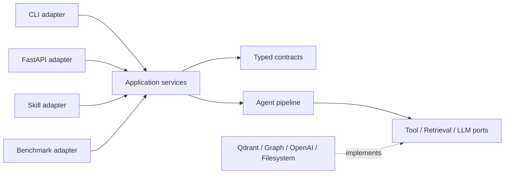

# Đánh giá tech debt về tổ chức mã nguồn

**Ngày chụp trạng thái:** 2026-09-14  
**Phạm vi:** `main.py`, `config.py`, `agents/`, `api/`, `commands/`, `core/`, `data/`, `evaluation/`, `rag/`, `tools/`, `utils/`, `scripts/`, `tests/`  
**Mục tiêu:** xác định các khoản nợ làm cấu trúc code thiếu hệ thống hoặc khiến hành vi không nhất quán giữa module; đề xuất thứ tự xử lý, không thiết kế lại thuật toán localization.

> Tài liệu đánh giá **working tree hiện tại**, không chỉ commit `HEAD`. Working tree đang có nhiều file sửa/xóa/chưa track, vì vậy mục “Blocker của snapshot hiện tại” được tách khỏi nợ kiến trúc dài hạn. Các line reference có thể dịch chuyển sau khi phần WIP được hoàn tất.

## 1. Kết luận điều hành

Repository đã có những nền tảng tốt: CLI được tách handler vào `commands/`, tool dùng registry chung, graph có `GraphBackend`, scoring có model riêng và test unit đã bao phủ một số thuật toán quan trọng. Tuy nhiên, các nền tảng này chưa tạo thành một kiến trúc thống nhất vì thiếu **application service** và **data contract** dùng chung.

Hệ quả là CLI, API, skill và benchmark script tự lắp pipeline theo các cách khác nhau. Trạng thái cấu hình toàn cục bị thay đổi trong lúc chạy song song; cùng một khái niệm kết quả được truyền bằng nhiều schema `dict`; graph có nhiều cache/factory; evaluation có nhiều runner và nhiều cách tính/xuất kết quả. Một số sai khác đã trở thành lỗi quan sát được, không còn chỉ là vấn đề thẩm mỹ code.

### Đánh giá tổng quan

| Khía cạnh | Mức hiện tại | Nhận định |
|---|---:|---|
| Phân ranh module | 2/5 | Có chia package nhưng trách nhiệm vẫn xuyên lớp và có vòng phụ thuộc |
| Tính nhất quán giữa entry point | 1/5 | CLI, API, skill, evaluator và script không dùng chung một use case |
| Data contract | 1/5 | Mutable context lớn, nhiều `dict`/`Any`/tuple vị trí; lỗi key dễ bị nuốt |
| Cấu hình và concurrency | 1/5 | Singleton mutable được ghi từ nhiều request/worker |
| Test và khả năng tái lập | 1/5 | Source runtime bị ignore; thiếu cấu hình pytest/CI/dev dependencies; snapshot đang lỗi collect |
| Tài liệu và hygiene | 2/5 | Nhiều tài liệu nhưng có nhiều source of truth và đã drift |

### Ưu tiên đề xuất

- **P0 – xử lý trước khi tiếp tục refactor/benchmark:** TD-01, TD-02, TD-03, TD-04.
- **P1 – hợp nhất kiến trúc:** TD-05 đến TD-10.
- **P2 – giảm chi phí bảo trì dài hạn:** TD-11 đến TD-13.

Không nên “big-bang rewrite”. Thứ tự an toàn là: làm repository tái lập được → cố định contract/config → tạo service dùng chung → chuyển từng adapter → cuối cùng mới tách các file lớn và di chuyển package.

## 2. Bản đồ hiện trạng

### 2.1. Các đường vào hệ thống

Hiện có ít nhất năm đường vào cùng năng lực localization/evaluation:

1. CLI `main.py` → `commands/*`.
2. FastAPI → `api/routes/*`.
3. Python skill → `skill.py`.
4. Evaluator dùng trong command generic → `evaluation/evaluator.py`.
5. Script nghiên cứu/benchmark → `scripts/*`.

Các đường này không hội tụ tại một application service. Chúng tạo orchestrator, retriever, worker pool, metrics và output theo cách riêng.

### 2.2. Hướng phụ thuộc package quan sát được

Phân tích static import trên các file Python đang track cho thấy:

```text
agents      -> core, data, evaluation, rag, tools, utils
api         -> agents, commands, data, evaluation, rag, tools
commands    -> agents, data, evaluation, rag, tools
data        -> tools
evaluation  -> agents, data, tools, utils
tools       -> rag
rag         -> utils
```

Điểm đáng chú ý nhất là vòng **`agents <-> evaluation`**. API còn import một helper private từ command, tức adapter web phụ thuộc adapter CLI thay vì cả hai phụ thuộc use case chung.

### 2.3. Chỉ dấu định lượng

- Khoảng **20.641 dòng Python** trong các package/script/test được thống kê (chưa tính source nằm trong `data/` bị ignore).
- Ba file production lớn nhất: [`agents/orchestrator.py`](../agents/orchestrator.py) 1.273 dòng, [`agents/comprehension.py`](../agents/comprehension.py) 1.024 dòng, [`rag/code_graph.py`](../rag/code_graph.py) 839 dòng.
- Một số function dài: `_apply_patch_owner_challenge` 197 dòng, `BaseAgent.run` 183 dòng, `BenchmarkEvaluator.evaluate` 153 dòng, `_apply_unified_scoring` 126 dòng.
- Có **71 vị trí đọc biến môi trường** trong `config.py` và **82 `except Exception`** trong các package production được rà soát.
- Git đang track hai log ở root: `django_run.log` và `prebuild_graphs.log` (tổng dung lượng khoảng 275 KB).

Các con số không tự động đồng nghĩa với code xấu, nhưng chúng xác nhận mức tập trung trách nhiệm và bề mặt cấu hình/error handling hiện đã đủ lớn để gây drift.

## 3. Danh mục tech debt

### TD-01 — Mã nguồn runtime nằm trong thư mục bị Git ignore

**Mức độ:** P0 / Critical  
**Phạm vi:** repository layout, reproducibility

#### Bằng chứng

- [`.gitignore:5`](../.gitignore#L5) ignore toàn bộ `data/`.
- Working tree lại chứa `data/loader.py`, `data/preprocessor.py`, `data/defects4j_loader.py` và `data/__init__.py`.
- Các module lõi import trực tiếp chúng, ví dụ [`agents/orchestrator.py:23`](../agents/orchestrator.py#L23), [`evaluation/evaluator.py:17`](../evaluation/evaluator.py#L17), [`commands/defects4j.py:15`](../commands/defects4j.py#L15), [`api/routes/benchmarks.py:54`](../api/routes/benchmarks.py#L54).
- `git ls-files` không trả về ba file source nói trên.

#### Tác động

Một clone sạch có thể thiếu loader và preprocessor, khiến CLI/API/test không import được. Tên `data/` đang gộp hai loại tài sản có lifecycle trái ngược: mã nguồn cần version control và dataset/checkouts/index cần ignore.

#### Hướng xử lý

Di chuyển code sang package được track, ví dụ `benchmarks/` hoặc `bugloc/datasets/`; chỉ để artifact tại `data/`. Nếu chưa thể di chuyển ngay, thay rule `data/` bằng các rule hẹp như `data/*_checkouts/`, `data/qdrant/`, `data/cache/` và force-add các file Python cốt lõi.

#### Tiêu chí hoàn tất

- Clone sạch import được `BugInstance`, `BugReportPreprocessor`, `Defects4JLoader`.
- `git ls-files` liệt kê toàn bộ source runtime.
- Không track checkout, vector index hoặc dataset tải về.

### TD-02 — Snapshot hiện tại không qua được test collection và thiếu test boundary

**Mức độ:** P0 / Blocker hiện tại  
**Phạm vi:** quality gate

#### Bằng chứng

- [`tools/code_search.py:1`](../tools/code_search.py#L1) hiện bắt đầu bằng `Hương"""`, gây `SyntaxError`. Diff cho thấy đây là thay đổi chưa commit, vì vậy nhiều khả năng là lỗi WIP chứ không phải thiết kế chủ đích.
- `PYTEST_DISABLE_PLUGIN_AUTOLOAD=1 python -m pytest tests --collect-only -q` tìm được 138 test nhưng dừng với **7 collection errors**, đều lan từ lỗi import trên.
- `python -m pytest --collect-only` tại root không hoàn tất trong 45 giây. Repository không có `pyproject.toml`, `pytest.ini`, `setup.cfg` hay `tox.ini` để đặt `testpaths`; pytest có thể duyệt cả `data/` chứa các checkout lớn.
- Không thấy test API/route hoặc CLI dispatch (`TestClient`, `/api/`, `run_evaluation`, `run_localization` không xuất hiện trong `tests/`).

#### Tác động

Không có feedback loop tin cậy để phân biệt refactor kiến trúc với regression. Lệnh test được ghi trong guideline (`python -m pytest`) không có boundary rõ ràng trong repository có lượng artifact lớn.

#### Hướng xử lý

Sửa blocker syntax sau khi xác nhận phần WIP; thêm cấu hình pytest với `testpaths = ["tests"]`, marker cho integration/external-service test và dev dependency rõ ràng. Thêm smoke test import package cùng contract test cho CLI/API/service.

#### Tiêu chí hoàn tất

- `python -m pytest --collect-only -q` hoàn tất nhanh từ root.
- `python -m compileall` qua trên toàn bộ source được track.
- CI chạy unit test không cần LLM, network, Neo4j hoặc dataset checkout.

### TD-03 — Singleton config mutable xung đột với thực thi song song

**Mức độ:** P0 / Critical nếu API hoặc benchmark multi-worker được sử dụng  
**Phạm vi:** config, concurrency, isolation

#### Bằng chứng

- [`config.py:308`](../config.py#L308) tạo singleton `config` toàn process.
- API localization ghi `config.enable_graph_rag` theo request tại [`api/routes/localize.py:49`](../api/routes/localize.py#L49); API evaluation làm tương tự tại [`api/routes/evaluate.py:61`](../api/routes/evaluate.py#L61).
- Hai API chạy qua thread pool riêng ([`api/routes/localize.py:18`](../api/routes/localize.py#L18), [`api/routes/evaluate.py:17`](../api/routes/evaluate.py#L17)). CLI/skill cũng mutate singleton tại [`commands/_shared.py:26`](../commands/_shared.py#L26) và [`skill.py:47`](../skill.py#L47).
- Orchestrator chọn implementation agent theo flag ngay trong constructor ([`agents/orchestrator.py:83`](../agents/orchestrator.py#L83)), trong khi các flag khác tiếp tục được đọc trong những phase sau.
- `config.py` còn monkey-patch `socket.getaddrinfo` ở import time ([`config.py:18`](../config.py#L18), [`config.py:60`](../config.py#L60)).

#### Tác động

Hai request có `use_graph_rag` khác nhau có thể ghi đè cấu hình của nhau. Một run có thể được khởi tạo theo bộ flag A nhưng phase sau đọc bộ flag B. Test bị phụ thuộc thứ tự. Import config có side effect toàn process ngoài phạm vi bài toán cấu hình.

#### Hướng xử lý

- Biến settings nạp từ env thành object immutable.
- Tạo `RunOptions`/`LocalizationOptions` immutable theo từng invocation và truyền vào `LocalizationService`/`Orchestrator`.
- Tiêm `LLMClient`, retriever, graph provider thay vì tra singleton trong method.
- Chuyển DNS pin thành transport/network adapter được bật rõ ràng lúc bootstrap, không monkey-patch khi import.

#### Tiêu chí hoàn tất

Chạy đồng thời hai localization với flag khác nhau cho kết quả cấu hình độc lập; không module nghiệp vụ nào gán vào singleton settings.

### TD-04 — Các entry point triển khai use case khác nhau và đã phát sinh lỗi hành vi

**Mức độ:** P0 / High  
**Phạm vi:** API, CLI, evaluation correctness

#### Bằng chứng

- API import helper private của CLI tại [`api/routes/localize.py:53`](../api/routes/localize.py#L53).
- `LocalizeRequest` khai báo `multi_pass` tại [`api/routes/localize.py:27`](../api/routes/localize.py#L27), nhưng `run_localization` luôn gọi `orchestrator.localize`, không dùng trường này.
- `EvaluateRequest` khai báo `benchmark` và `output_path` ([`api/routes/evaluate.py:22`](../api/routes/evaluate.py#L22)), nhưng implementation luôn chạy Defects4J và không ghi output path.
- `run_evaluation` import `mrr` và `mean_average_precision` tại [`api/routes/evaluate.py:59`](../api/routes/evaluate.py#L59), nhưng `evaluation.metrics` không định nghĩa hai symbol này; job hiện sẽ rơi thẳng vào nhánh `failed` trước khi load dữ liệu.
- Khi `project` không truyền, loader mặc định `Lang` nhưng repo path lại dùng trực tiếp `request.project`, tạo segment `None` ([`api/routes/evaluate.py:63`](../api/routes/evaluate.py#L63), [`api/routes/evaluate.py:74`](../api/routes/evaluate.py#L74)).
- API tự tính MRR thay vì dùng `evaluation.metrics`, rồi gán `map = mrr` tại [`api/routes/evaluate.py:97`](../api/routes/evaluate.py#L97) và [`api/routes/evaluate.py:123`](../api/routes/evaluate.py#L123). Với nhiều ground-truth file, công thức hiện tại cộng reciprocal rank của mọi match thay vì chỉ first relevant result.
- `commands/swebench.py` và `commands/sweexplore.py` load file trong `scripts/` bằng `importlib.util.spec_from_file_location` ([`commands/swebench.py:17`](../commands/swebench.py#L17), [`commands/sweexplore.py:26`](../commands/sweexplore.py#L26)).

#### Tác động

Cùng một request logic cho kết quả khác tùy gọi qua CLI hay API. API schema tạo cảm giác một tính năng được hỗ trợ dù implementation bỏ qua. Sai lệch metric có thể làm kết luận nghiên cứu không so sánh được giữa runner.

#### Hướng xử lý

Tạo ba application service duy nhất:

- `LocalizationService.localize(request) -> LocalizationResult`
- `EvaluationService.evaluate(request) -> EvaluationResult`
- `GraphService` cho build/search/stats/data

CLI, API và skill chỉ parse/validate input, gọi service, serialize output. Script nghiên cứu có thể gọi service hoặc runner library; không được trở thành implementation của command production.

#### Tiêu chí hoàn tất

Một fixture chạy qua CLI adapter, API adapter và Python API tạo cùng options và cùng normalized result/metrics; field public nào cũng được dùng hoặc bị loại khỏi schema.

### TD-05 — Data contract giữa agent/phase quá lỏng và quá mutable

**Mức độ:** P1 / High  
**Phạm vi:** domain model, agent protocol

#### Bằng chứng

- [`AgentContext`](../agents/base_agent.py#L48) là mutable bag gồm input, preprocessing, candidate, retriever, graph, trace, reflection, hypothesis và transient verify state. Nhiều trường chỉ có type `list`, `dict` hoặc `Any` ([`agents/base_agent.py:58`](../agents/base_agent.py#L58), [`agents/base_agent.py:88`](../agents/base_agent.py#L88), [`agents/base_agent.py:109`](../agents/base_agent.py#L109)).
- [`AgentResult.output`](../agents/base_agent.py#L126) là `dict`; [`LocalizationResult.ranked_locations`](../agents/orchestrator.py#L31) là `list[dict]`; các phase đọc key bằng `.get()` và fallback âm thầm.
- Tool registry khai báo `dict[str, tuple]` ([`tools/registry.py:221`](../tools/registry.py#L221)). Dependency của tool được inject bằng cách dò tên parameter runtime tại [`agents/base_agent.py:490`](../agents/base_agent.py#L490).
- Batch helper trả tuple 10 phần tử ([`commands/_shared.py:130`](../commands/_shared.py#L130)) và gắn lambda `_to_bug_instance` động vào object dataset ([`commands/defects4j.py:87`](../commands/defects4j.py#L87)).

#### Tác động

Contract tồn tại trong comment/prompt thay vì type system. Đổi tên một key hoặc đổi shape có thể không fail fast mà chỉ làm candidate/scoring biến mất. Context có lifetime không rõ và khó chạy song song/test độc lập.

#### Hướng xử lý

Định nghĩa model rõ ràng: `BugReport`, `ProcessedBug`, `CandidateLocation`, `AgentVerdict`, `Usage`, `LocalizationResult`, `EvaluationRecord`, `ToolSpec`. Tách `RunContext` immutable khỏi `PipelineState` mutable; mỗi phase trả output typed thay vì ghi nhiều field vào một context chung. Dùng protocol cho retriever/graph/tool dependency.

#### Tiêu chí hoàn tất

Không còn `list[dict]` ở public/internal phase boundary quan trọng; serializer nằm ở adapter; validation thất bại tại boundary thay vì rơi vào fallback không lý do.

### TD-06 — Ranh giới module bị đảo chiều và có vòng phụ thuộc

**Mức độ:** P1 / High  
**Phạm vi:** package architecture

#### Bằng chứng

- `agents` gọi metric/scorer/reranker trong `evaluation`, ví dụ [`agents/orchestrator.py:404`](../agents/orchestrator.py#L404), [`agents/orchestrator.py:960`](../agents/orchestrator.py#L960).
- `evaluation` lại import `Orchestrator` và `BaseAgent`, ví dụ [`evaluation/evaluator.py:18`](../evaluation/evaluator.py#L18), [`evaluation/reranker.py:24`](../evaluation/reranker.py#L24).
- Reranker kế thừa `BaseAgent` chỉ để tái sử dụng LLM client/JSON parser ([`evaluation/reranker.py:33`](../evaluation/reranker.py#L33)), cho thấy hạ tầng LLM đang bị buộc vào abstraction agent.
- `api -> commands` qua `_make_retriever`; `tools -> rag`; agent đồng thời biết `data`, `rag`, `evaluation`, `tools`.

#### Tác động

Không thể thay scorer, LLM client, runner hoặc adapter độc lập. Import order và local import trở thành cơ chế tránh cycle. Unit test buộc phải patch ở nhiều lớp.

#### Hướng xử lý

Đặt model/protocol ổn định ở `core` hoặc `domain`; use case ở `application`; LLM/retrieval/graph là implementation được inject; API/CLI/skill là adapter; evaluation tiêu thụ application API chứ application không phụ thuộc benchmark runner.



Rule cần bảo vệ: adapter không import adapter; domain không import infrastructure/evaluation; agent không import benchmark loader.

### TD-07 — Orchestrator và một số module tập trung quá nhiều trách nhiệm

**Mức độ:** P1 / Medium–High  
**Phạm vi:** maintainability

#### Bằng chứng

- [`Orchestrator`](../agents/orchestrator.py#L69) quản lý: preprocessing, graph background/cache, agent lifecycle, reflection, candidate pool, path validation, scoring, rerank, multi-pass, thống kê token và Rich console rendering.
- `_apply_unified_scoring` dài 126 dòng và tự dựng config, gọi graph/vector retrieval, score, mutate result, format console ([`agents/orchestrator.py:942`](../agents/orchestrator.py#L942)).
- [`ComprehensionAgent`](../agents/comprehension.py) vừa search filesystem, dựng prompt, parse/normalize path, structured extraction, verify shot, owner challenge và hypothesis handling; `_apply_patch_owner_challenge` dài 197 dòng.
- [`BaseAgent.run`](../agents/base_agent.py#L208) gộp LLM loop, parallel tool execution, history budget, usage tracking, fallback và error handling trong 183 dòng.

#### Tác động

Feature flag mới thường được chèn vào class trung tâm, làm số nhánh tăng và khó chứng minh invariants. Thay đổi prompt dễ chạm lifecycle/tool/runtime; thay scoring dễ chạm orchestration/UI.

#### Hướng xử lý

Sau khi có typed contract, tách theo capability: `PipelineRunner`, `GraphProvider`, `CandidatePoolBuilder`, `ScoringPipeline`, `MultiPassAggregator`, `AgentRuntime`, `Prompt/ResponseAdapter`. Rich rendering chuyển ra CLI presenter. Không tách chỉ để giảm số dòng; mỗi component phải có input/output và owner rõ.

### TD-08 — Graph abstraction, lifecycle và cache không nhất quán

**Mức độ:** P1 / High  
**Phạm vi:** `rag/`, `tools/`, API graph

#### Bằng chứng

- `GraphBackend` nói dùng `InMemoryGraph` hoặc `Neo4jGraph`, nhưng implementation in-memory thực tế là `CodePropertyGraph`; không có class `InMemoryGraph`.
- API vẫn import `InMemoryGraph` không tồn tại tại [`api/routes/graph.py:81`](../api/routes/graph.py#L81), nên `/api/graph/data` fail trước khi xử lý.
- Cùng route truy cập concrete attributes `graph.nodes` và `graph.edges` ([`api/routes/graph.py:98`](../api/routes/graph.py#L98), [`api/routes/graph.py:118`](../api/routes/graph.py#L118)) thay vì `all_nodes()`/`all_edges()` trong interface; không tương thích Neo4j.
- API và orchestrator còn đọc `node.data`, trong khi `GraphRetriever.search()` trả `GraphSearchResult` có contract `result.node.file_path`/`result.score` ([`rag/graph_retriever.py:28`](../rag/graph_retriever.py#L28), [`agents/orchestrator.py:676`](../agents/orchestrator.py#L676), [`api/routes/graph.py:148`](../api/routes/graph.py#L148)). Trong candidate/scoring, lỗi này bị `except Exception` nuốt nên tín hiệu graph có thể biến mất âm thầm.
- `/stats` dùng cache từ `tools.graph_search`, `/search` lại tạo `GraphRetriever` và build mới mỗi request ([`api/routes/graph.py:64`](../api/routes/graph.py#L64), [`api/routes/graph.py:139`](../api/routes/graph.py#L139)).
- Có cache ở cả [`tools/graph_search.py:14`](../tools/graph_search.py#L14) và [`agents/orchestrator.py:72`](../agents/orchestrator.py#L72). Cache tool chỉ key theo path/backend, còn orchestrator có logic commit/language riêng. Không thấy eviction/lifecycle close thống nhất.

#### Tác động

Route hoạt động khác nhau theo backend; graph có thể stale sau checkout/branch change; cùng repo có thể build nhiều lần và giữ bộ nhớ vô hạn. Việc fallback Neo4j/in-memory không còn transparent như abstraction tuyên bố.

#### Hướng xử lý

Tạo `GraphService` và một `GraphRepository` protocol duy nhất; mọi consumer chỉ dùng method của interface. Gom factory/cache/key/eviction/close vào một owner. Cache key phải gồm canonical path, commit, language, backend và namespace/repo ID.

### TD-09 — Evaluation bị phân mảnh thành nhiều runner và schema

**Mức độ:** P1 / High, đặc biệt với tính hợp lệ kết quả nghiên cứu  
**Phạm vi:** evaluation, commands, scripts, API

#### Bằng chứng

- Có ít nhất ba batch implementation: [`evaluation/evaluator.py`](../evaluation/evaluator.py), [`commands/_shared.py`](../commands/_shared.py), [`scripts/run_swebench_benchmark.py`](../scripts/run_swebench_benchmark.py); API lại có vòng lặp thứ tư.
- Schema record không đồng nhất: `predicted_files`/`ground_truth_files` trong evaluator, `predicted`/`ground_truth` trong shared command/export, `ranked_files`/`ground_truth` trong API.
- `commands/_shared.process_bug` tự lo path resolution, timeout, localization, file/method metrics, usage và error conversion trong 113 dòng.
- API bỏ qua `compute_metrics`; exporter còn tính lại hit bằng basename logic riêng tại [`evaluation/export.py:90`](../evaluation/export.py#L90), có thể khác `_paths_match` trong `evaluation.metrics`.

#### Tác động

Khó so sánh kết quả giữa dataset/entry point; sửa metric hoặc output phải sửa nhiều nơi; metadata và error record khác nhau. Đây là rủi ro trực tiếp đối với reproducibility của luận văn.

#### Hướng xử lý

Một `EvaluationRunner` nhận `BenchmarkAdapter`, `LocalizationService`, `MetricSuite`, `ResultSink`. Chỉ `MetricSuite` được quyền tính metric; CSV/JSON/API chỉ serialize cùng `EvaluationRecord`. Timeout/concurrency là policy của runner, không nằm trong dataset-specific command.

### TD-10 — Cấu hình feature/experiment và dependency chưa có cấu trúc vận hành

**Mức độ:** P1 / Medium–High  
**Phạm vi:** config, packaging

#### Bằng chứng

- [`Config`](../config.py#L141) chứa runtime setting, concurrency, timeout, agent strategy và nhiều flag E1/E2/E3/ablation trong cùng dataclass; 71 vị trí đọc env trong file.
- Boolean được parse theo hai quy ước: `in ("true", "1", "yes")` và `not in ("false", "0", "no")`; giá trị typo có thể thành `False` ở flag này nhưng `True` ở flag khác.
- `confirmation_single_shot` và `confirmation_mode` cùng tồn tại để backward compatibility ([`config.py:236`](../config.py#L236), [`config.py:243`](../config.py#L243)), tạo hai nguồn điều khiển cùng behavior.
- [`requirements.txt`](../requirements.txt) chỉ có lower bound rộng, trộn runtime, graph, visualization, web, MCP và model-local dependencies; không có `pytest`/dev group, lockfile hay project metadata.
- Nhiều entry point thêm project root vào `sys.path` (`main.py`, `api/main.py`, `skill.py`, script và test), cho thấy project chưa được đóng gói/import theo một cơ chế chuẩn.

#### Tác động

Run khó tái lập theo thời gian; cấu hình sai không fail fast; dependency install nặng dù chỉ dùng CLI tối thiểu. Flag cũ tồn tại lâu làm số tổ hợp behavior tăng nhanh.

#### Hướng xử lý

Chia `AppSettings`, `LLMSettings`, `RetrievalSettings`, `EvaluationSettings`, `ExperimentProfile`; dùng một parser bool/validation duy nhất; profile hóa baseline/E1/E2/E3 và lưu snapshot config vào mỗi result. Đóng gói project bằng `pyproject.toml`, tách extras (`graph`, `api`, `local-embedding`, `dev`) và khóa môi trường benchmark.

### TD-11 — Error policy thiên về “fail open” nhưng thiếu tín hiệu quan sát

**Mức độ:** P2 / Medium  
**Phạm vi:** resilience, observability

#### Bằng chứng

- Có 82 `except Exception` trong các package production được rà soát.
- Tool runtime đổi exception thành string tại [`agents/base_agent.py:516`](../agents/base_agent.py#L516).
- Scoring/retrieval/reranking thường log debug/warning rồi bỏ qua, ví dụ [`agents/orchestrator.py:1002`](../agents/orchestrator.py#L1002), [`agents/orchestrator.py:1016`](../agents/orchestrator.py#L1016).
- API trả raw `str(e)` hoặc cả traceback vào job state ([`api/routes/localize.py:82`](../api/routes/localize.py#L82), [`api/routes/evaluate.py:129`](../api/routes/evaluate.py#L129)).

#### Tác động

Pipeline có thể trả `success=True` sau khi mất một capability quan trọng nhưng downstream không biết run đã degraded ở đâu. Ngược lại, API có thể lộ chi tiết nội bộ. Việc benchmark lỗi hạ tầng và lỗi thuật toán bị trộn.

#### Hướng xử lý

Định nghĩa taxonomy (`ValidationError`, `CapabilityUnavailable`, `ExternalServiceError`, `PipelineError`) và `RunDiagnostic` typed. Chỉ fail-open ở capability được tuyên bố optional; luôn ghi degraded flags/metrics. API trả error code an toàn, traceback chỉ ở structured log nội bộ.

### TD-12 — Tài liệu có nhiều source of truth và đã drift khỏi code

**Mức độ:** P2 / Medium  
**Phạm vi:** docs

#### Bằng chứng

- README mô tả `frontend/` và lệnh `cd frontend` ([`README.md:94`](../README.md#L94), [`README.md:152`](../README.md#L152)), nhưng snapshot không có thư mục này.
- `ARCHITECTURE.md` liệt kê command `bugsinpy` tại [`ARCHITECTURE.md:113`](../ARCHITECTURE.md#L113), trong khi `main.py` dispatch `sweexplore` và không có `bugsinpy` ([`main.py:209`](../main.py#L209)).
- Default model trong [`config.py:71`](../config.py#L71) là `gemini-2.0-flash`, README/architecture ghi `gemini-2.5-flash`.
- Tài liệu cùng lúc gọi UnifiedScorer là 9 và 10 tín hiệu, kể cả trong chính `ARCHITECTURE.md`.
- Root chứa log được track; `docs/` trộn Markdown nguồn với PDF/PPTX/HTML/PNG sinh ra mà chưa thấy policy artifact.

#### Tác động

Người mới không biết tài liệu nào là authoritative; setup theo README có thể thất bại; thay đổi kiến trúc phải cập nhật nhiều bản sao thủ công.

#### Hướng xử lý

Chọn một tài liệu kiến trúc canonical ngắn, sinh bảng config/CLI từ code nếu có thể, và thêm `docs/archive/` cho báo cáo lịch sử. Quy định rõ artifact nào được track. Xóa log khỏi Git history trong một commit hygiene riêng (không trộn với refactor).

### TD-13 — Quy ước code chưa được tự động bảo vệ

**Mức độ:** P2 / Medium  
**Phạm vi:** engineering governance

#### Bằng chứng

- Không có formatter/linter/type-checker config hoặc CI config trong snapshot.
- Public API còn thiếu type cụ thể (`args`, `processed`, `retriever=None`, `dict`, `list`) dù guideline yêu cầu type hint.
- Import được đặt giữa file/giữa method để né dependency/cost; `sys.path.insert` lặp ở app, script và test.
- Test file vừa dùng pytest vừa chứa `pytest.main()`/`main()` executable boilerplate.

#### Tác động

Quy ước chỉ tồn tại trong tài liệu, nên typo import, unused import, circular dependency và contract drift chỉ lộ khi chạy một path cụ thể.

#### Hướng xử lý

Thiết lập tối thiểu Ruff + pytest + compile/import smoke trong pre-commit/CI; sau khi typed contract ổn định mới bật type checker theo package từng bước. Không bật hàng loạt rule rồi sửa cơ học cùng commit kiến trúc.

## 4. Kiến trúc đích tối thiểu

Đây là cấu trúc logic đề xuất; không bắt buộc di chuyển toàn bộ file ngay ở phase đầu:

```text
bugloc/
├── domain/
│   ├── models.py             # BugReport, CandidateLocation, Result, Usage
│   └── errors.py
├── application/
│   ├── localization.py       # use case duy nhất
│   ├── evaluation.py         # runner/metric suite
│   └── graph.py              # graph lifecycle/query
├── agents/
│   ├── runtime.py            # LLM/tool loop
│   ├── comprehension.py
│   ├── navigation.py
│   └── confirmation.py
├── ports/
│   ├── llm.py
│   ├── tools.py
│   ├── retrieval.py
│   └── graph.py
├── infrastructure/
│   ├── llm/
│   ├── qdrant/
│   ├── graph/
│   └── filesystem/
└── benchmarks/               # loader/adapters được track

interfaces/
├── cli/                      # argparse vẫn ở main.py theo guideline hiện tại
├── api/
└── skill/

data/                         # chỉ artifact, checkout, index; ignored
scripts/                      # entry point nghiên cứu mỏng, gọi application API
tests/
```

Điểm quan trọng là **hướng phụ thuộc**, không phải tên thư mục. Có thể đạt kiến trúc này dần trong layout hiện tại bằng cách thêm `core/contracts.py` và `services/` trước, rồi mới cân nhắc chuyển sang `src/` package.

## 5. Lộ trình xử lý đề xuất

### Phase 0 — Khôi phục baseline tin cậy (1–2 ngày)

1. Tách source khỏi `data/` ignored và xác nhận clone sạch.
2. Xử lý syntax error WIP trong `tools/code_search.py`.
3. Thêm pytest test boundary, compile/import smoke và CI tối thiểu.
4. Sửa hoặc tạm ẩn các API contract đang sai rõ ràng (`multi_pass`, evaluation fields, graph `/data`).

**Exit gate:** clean clone cài được, import được, collect/test unit được; không endpoint nào quảng bá field bị bỏ qua.

### Phase 1 — Cố định contract và isolation (3–5 ngày)

1. Tạo typed models cho request/result/location/usage/evaluation record.
2. Tạo immutable settings + per-run options; loại bỏ ghi singleton.
3. Tách LLM client/JSON parser/tool executor khỏi `BaseAgent` thành runtime/service có thể inject.
4. Thêm contract tests cho result normalization và hai run song song.

**Exit gate:** phase boundary typed; config của một run không ảnh hưởng run khác.

### Phase 2 — Hội tụ các entry point và evaluation (4–7 ngày)

1. Tạo `LocalizationService` và chuyển CLI, skill, API sang gọi chung.
2. Tạo `EvaluationRunner`/`MetricSuite` duy nhất; chuyển command/API/script từng cái một.
3. Chuẩn hóa result schema và config snapshot trong artifact benchmark.
4. Xóa dynamic script import, object monkey-patch và tuple return dài.

**Exit gate:** cùng fixture cho normalized result/metric giống nhau qua mọi adapter.

### Phase 3 — Hợp nhất graph và giảm god module (5–10 ngày)

1. Gom graph factory/cache/lifecycle; sửa mọi consumer dùng interface.
2. Tách candidate pool, scoring pipeline, multi-pass và console presenter khỏi orchestrator.
3. Tách comprehension owner challenge/search/prompt/parse theo capability.
4. Loại vòng `agents <-> evaluation` và enforce dependency rule.

**Exit gate:** package dependency graph một chiều; graph backend contract test chạy cho in-memory và Neo4j fake.

### Phase 4 — Governance liên tục (2–4 ngày ban đầu)

1. `pyproject.toml`, dependency groups/lock, Ruff, pytest markers, CI.
2. Chuẩn hóa error taxonomy/diagnostics.
3. Chọn architecture doc canonical và archive tài liệu lịch sử/artifact.
4. Thêm architectural tests hoặc import-linter rule cho hướng phụ thuộc.

**Ước lượng tổng:** khoảng 15–25 ngày công, phụ thuộc mức tương thích ngược cần giữ cho script/result cũ và việc API có được coi là production hay chỉ demo. Phase 0 và phần isolation của Phase 1 nên làm trước mọi benchmark mới; các phase sau có thể chia nhỏ theo commit.

## 6. Backlog ra quyết định

| Thứ tự | Quyết định/deliverable | Giá trị | Rủi ro nếu trì hoãn |
|---:|---|---|---|
| 1 | Source benchmark/preprocessor phải được track ở đâu? | Clone sạch, CI khả dụng | Mất source hoặc chỉ chạy được trên máy hiện tại |
| 2 | API là production, demo hay experimental? | Xác định mức hardening/auth/job storage | Tiếp tục có schema “hứa nhưng không làm” |
| 3 | Chọn result schema canonical | So sánh benchmark và adapter nhất quán | Metric/artifact tiếp tục drift |
| 4 | Chọn settings/profile canonical | Run tái lập, không race | Kết quả song song không đáng tin |
| 5 | Chọn owner duy nhất cho graph cache/lifecycle | Giảm rebuild/stale graph | Memory tăng, backend khác hành vi |
| 6 | Mức backward compatibility cho script/result cũ | Chốt scope migration | Cờ/config/adapter legacy kéo dài |

## 7. Quality gates nên áp dụng sau cải tổ

```bash
# Clone sạch / import smoke
python -m compileall agents api commands core evaluation rag tools utils main.py config.py skill.py
python -c "from agents.orchestrator import Orchestrator"

# Unit mặc định, không quét dataset/checkouts
python -m pytest -q

# Integration tách riêng
python -m pytest -m integration -q

# Static checks
ruff check .
ruff format --check .
```

Ngoài pass/fail, mỗi benchmark artifact nên ghi: Git commit, dirty flag, dataset revision, model/provider, full resolved run options, dependency/environment identifier, degraded capabilities và metric suite version.

## 8. Những việc không nên làm ngay

- Không di chuyển toàn bộ package chỉ để “cấu trúc đẹp” trước khi có contract test.
- Không gộp sửa metric, đổi prompt và refactor orchestration trong cùng commit/experiment.
- Không xóa mọi `except Exception` cơ học; trước tiên phân loại capability optional và error contract.
- Không duy trì song song API/service mới và runner cũ vô thời hạn; mỗi bước migration phải có điều kiện xóa đường cũ.
- Không coi việc tăng test count là đủ; ưu tiên parity test giữa adapter, concurrency isolation và clean-clone smoke.

## 9. Phương pháp và giới hạn đánh giá

Đánh giá dựa trên CodeGraph, static import map, đọc trực tiếp source hiện tại, Git tracking/status, thống kê LOC/config/error handler và pytest collection. Không gọi LLM/network/Neo4j, không chạy benchmark end-to-end và không đánh giá chất lượng localization. Do snapshot đang dirty, các lỗi syntax/xóa test được xem là blocker trạng thái hiện tại; chỉ những pattern xuất hiện xuyên module mới được xếp vào tech debt kiến trúc.
