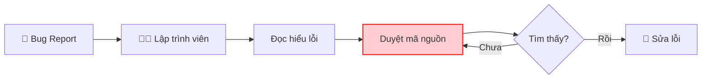
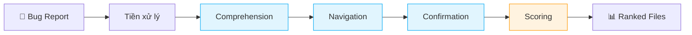
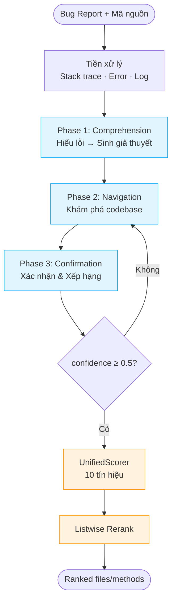
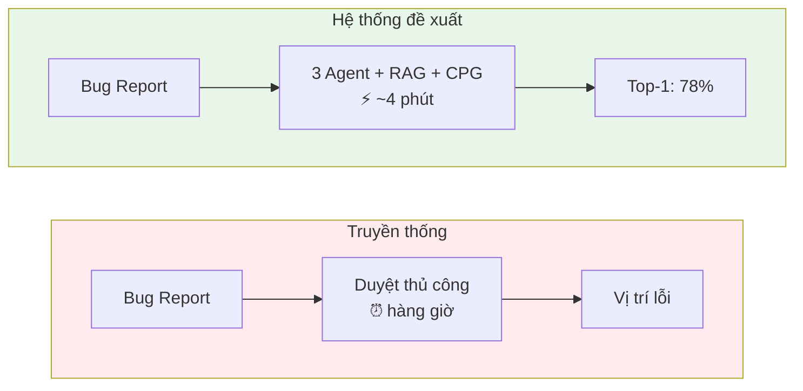

# Đồ thị Mermaid — Quy trình khi lỗi được báo cáo

## 1. Quy trình truyền thống (Thủ công)

> Bước "Duyệt mã nguồn" là **bottleneck** — chiếm 30–50% tổng thời gian.

---

## 2. Quy trình với hệ thống đề xuất

---

## 3. Pipeline chi tiết

---

## 4. So sánh

