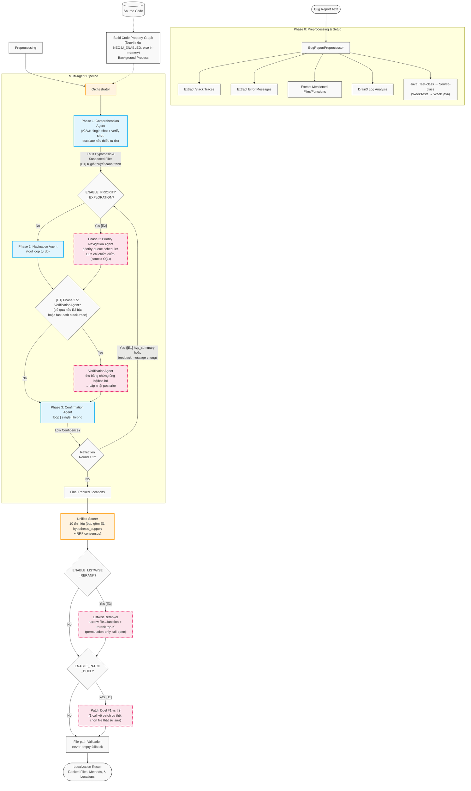
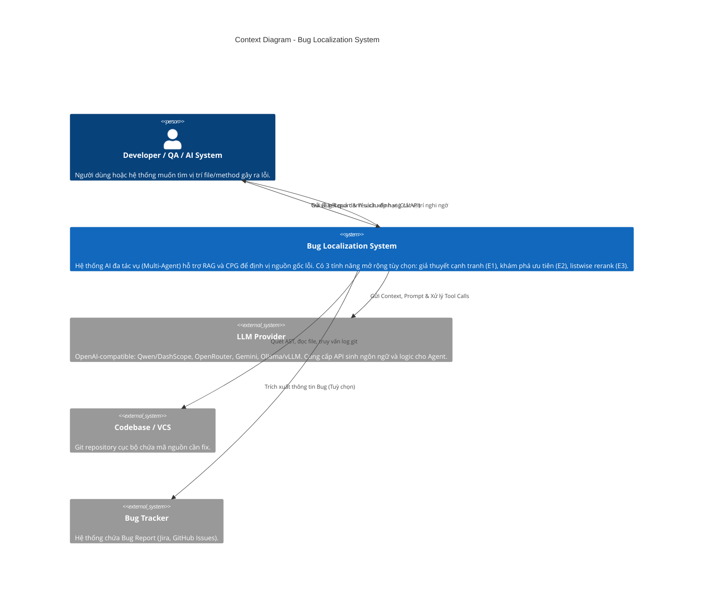
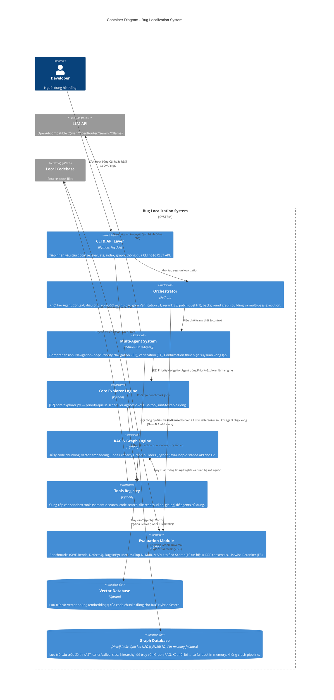
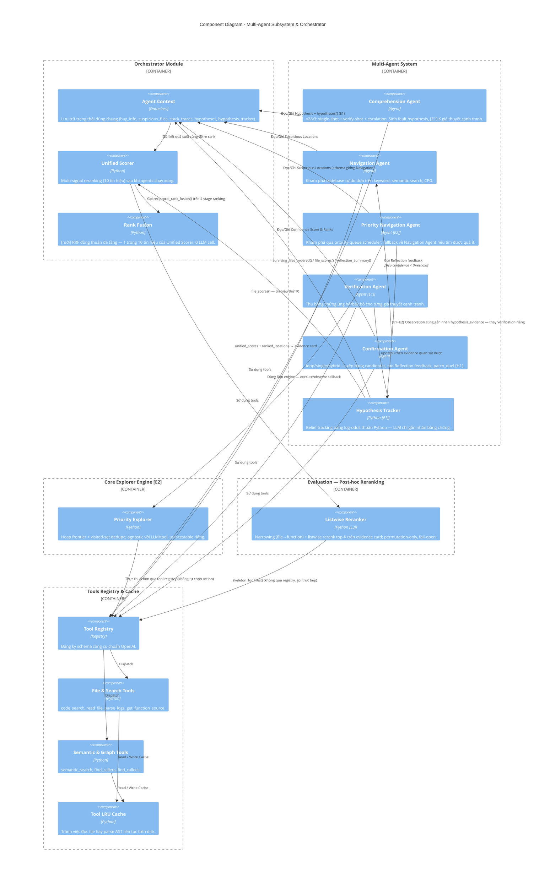
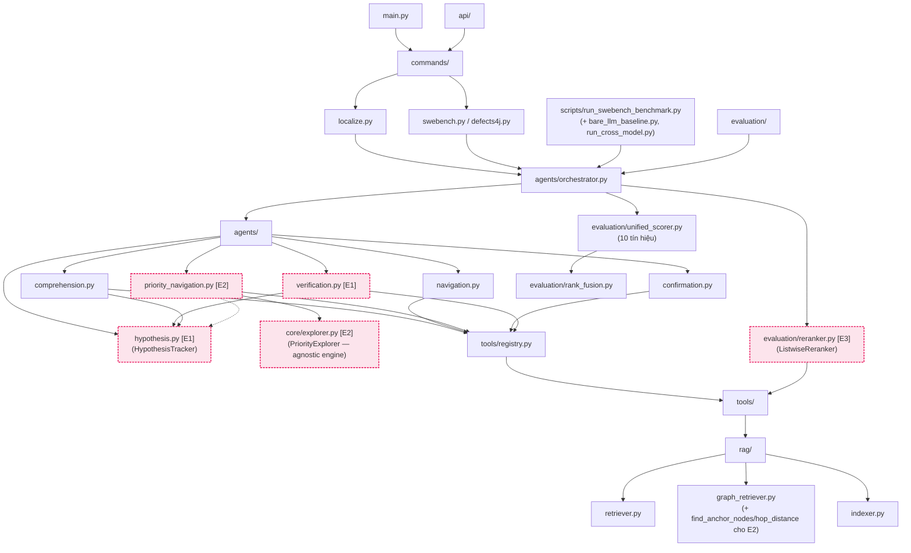

# Tài liệu Kiến trúc Hệ thống Bug Localization (Multi-Agent & RAG)

> Cập nhật: 2026-07-12 — đã thêm E1 (giả thuyết cạnh tranh), E2 (khám phá hàng đợi ưu tiên), E3 (thu hẹp phân cấp + listwise rerank), H1 (patch duel), và Neo4j làm graph backend mặc định khi khả dụng. Chi tiết dạng text xem [ARCHITECTURE.md](../ARCHITECTURE.md); bối cảnh nghiên cứu xem [SYSTEM_DESIGN.md](SYSTEM_DESIGN.md).

Tài liệu này mô tả kiến trúc tổng thể của hệ thống Bug Localization. Hệ thống sử dụng mô hình Multi-Agent kết hợp với Retrieval-Augmented Generation (RAG) và Code Property Graph (CPG) để tìm kiếm và định vị nguyên nhân gây lỗi trong mã nguồn một cách tự động. Ba tính năng mở rộng E1/E2/E3 đều có công tắc `.env` riêng, **mặc định tắt**, và không đổi schema output nên có thể bật/tắt độc lập.

---

## 1. Luồng xử lý tổng thể (Overall Pipeline Flowchart)

Luồng xử lý mô tả cách một Bug Report đầu vào được tiền xử lý và trải qua các vòng lặp của Multi-Agent System để ra kết quả định vị cuối cùng (sơ đồ vẽ với mọi flag bật; mặc định E1/E2/E3/H1 tắt nên pipeline rút gọn về Comprehension → Navigation → Confirmation → UnifiedScorer như bản gốc).



---

## 2. Mô hình Kiến trúc C4 (C4 Model)

Các biểu đồ dưới đây mô tả hệ thống theo tiêu chuẩn kiến trúc C4 Model (Context, Container, Component).

### 2.1 C4 - Context Diagram

Biểu đồ Context thể hiện hệ thống Bug Localization tương tác như thế nào với người dùng (Developer) và các hệ thống bên ngoài như VCS (Git), LLM Provider và Bug Tracker.



### 2.2 C4 - Container Diagram

Biểu đồ Container đi sâu vào các khối kiến trúc chính (vùng lưu trữ, logic nghiệp vụ, các pipeline module) bên trong Hệ thống Bug Localization.



### 2.3 C4 - Component Diagram (Multi-Agent Subsystem)

Biểu đồ Component mô tả sâu hơn cơ chế hoạt động tương tác bên trong `Multi-Agent System` kết nối với `Tools Registry`, `Core Explorer Engine` và `RAG & Graph Engine`.



---

## 3. Kiến Trúc RAG và Code Property Graph (CPG)

Một phần cốt lõi của hệ thống để hỗ trợ tác vụ Navigation của LLM là engine RAG và Code Property Graph. Neo4j nay là backend mặc định khi `NEO4J_ENABLED=true` — kết nối lỗi tự fallback in-memory (bắt `ConnectionError` từ driver), không làm crash pipeline.

```mermaid
flowchart LR
    CB[(Local Codebase)] --> IDX[Codebase Indexer]
    CB --> CPG[Code Graph Builders\nAST Python / Regex Java]

    IDX --> EMB[Code Embedder\nJina/OpenAI-compatible]
    EMB --> QD[(Qdrant Vector DB)]
    IDX --> BM25[(BM25 Fulltext Index)]

    CPG --> N4JCHECK{NEO4J_ENABLED\nvà kết nối OK?}
    N4JCHECK -- Yes --> N4J[(Neo4j\npersistent, partition theo repo_id)]
    N4JCHECK -- "No / lỗi kết nối" --> MEM[(In-memory\nCodePropertyGraph)]

    subgraph Retrieval Layer
        RET[Code Retriever]
        GRET[Graph Retriever]
    end

    QD -. "Semantic Vector Search" .-> RET
    BM25 -. "Lexical Search" .-> RET
    RET -- "Reciprocal Rank Fusion\n(Hybrid)" --> RES1[Semantic Results]

    N4J -. "Cypher / Graph Traversal" .-> GRET
    MEM -. "In-memory BFS" .-> GRET
    GRET -- "BFS Expansion\n(Callers/Callees)" --> RES2[Graph RAG Results — search()]
    GRET -- "[E2] find_anchor_nodes()" --> RES3[Anchor nodes cho priority scheduler]
    GRET -- "[E2] file_hop_distances() / hop_distance()\n(LRU cache 2048)" --> RES4[Graph-proximity term\ntrong priority()]

    %% styles
    classDef db fill:#e8f5e9,stroke:#4caf50,stroke-width:2px;
    classDef logic fill:#e3f2fd,stroke:#1976d2,stroke-width:2px;
    classDef ext fill:#fce4ec,stroke:#e91e63,stroke-width:2px,stroke-dasharray: 4 2;
    class QD,BM25,N4J,MEM,CB db;
    class IDX,CPG,EMB,RET,GRET logic;
    class RES3,RES4 ext;
```

---

## 4. Các luồng phụ thuộc Dependencies giữa các Modules

Biểu đồ thể hiện cách các module mã nguồn được tổ chức và liên kết phụ thuộc lẫn nhau trong file system (tham chiếu đến phần `10. Sơ Đồ Dependency Giữa Các Module` trong [ARCHITECTURE.md](../ARCHITECTURE.md)).



---

Văn bản tài liệu này có thể được sử dụng làm file tham khảo để nhúng vào Github Wiki, Markdown Viewer, hoặc xuất báo cáo chính thức. Hệ thống hỗ trợ xem bằng các công cụ hiển thị Mermaid.js mặc định.
