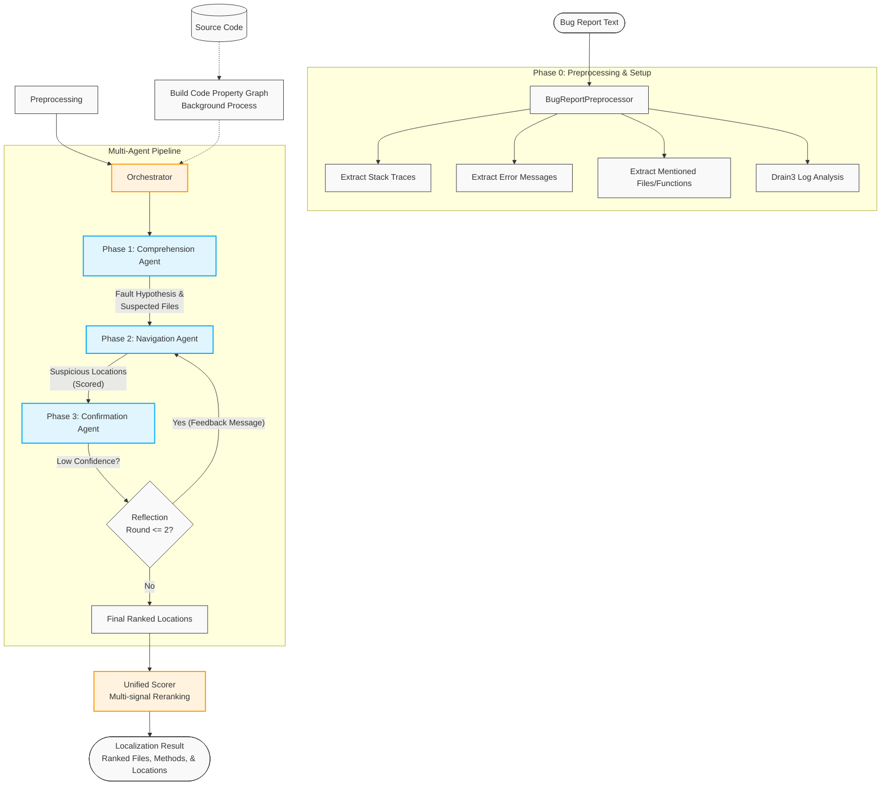
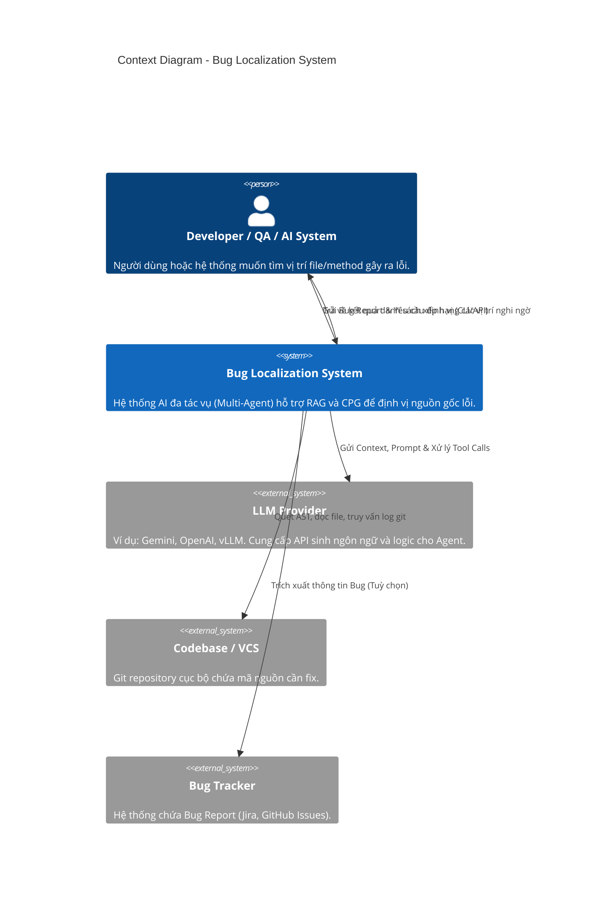
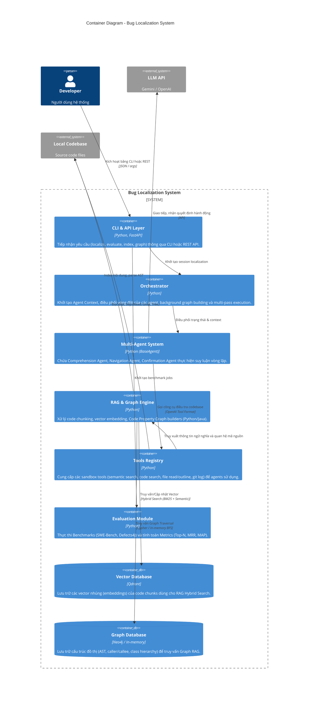
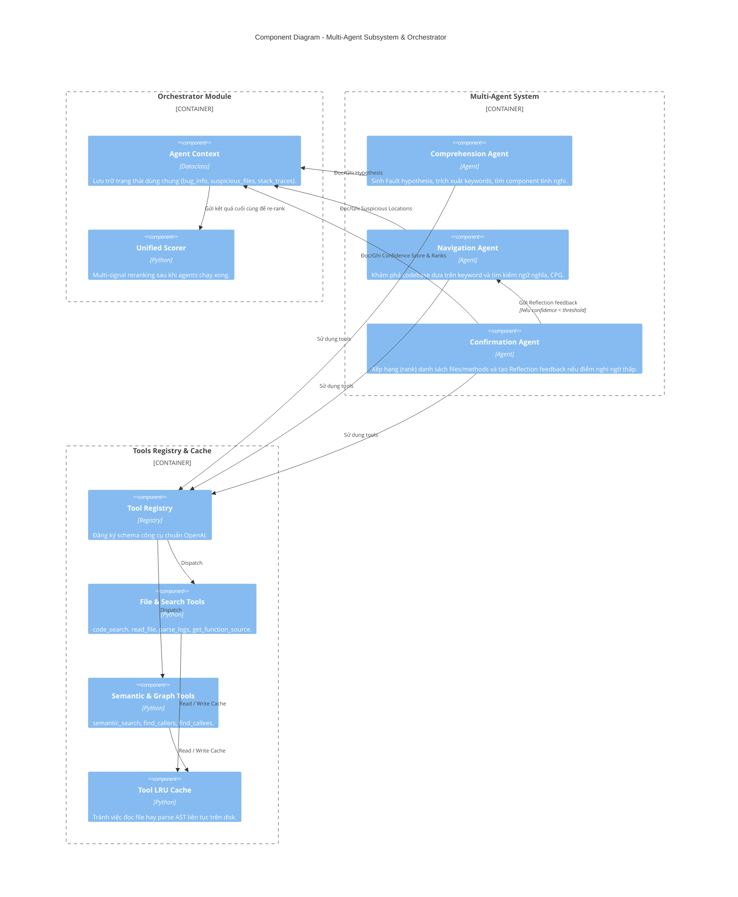
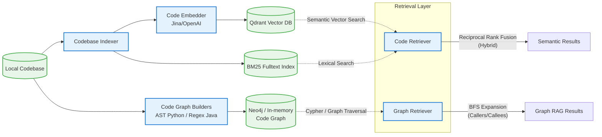
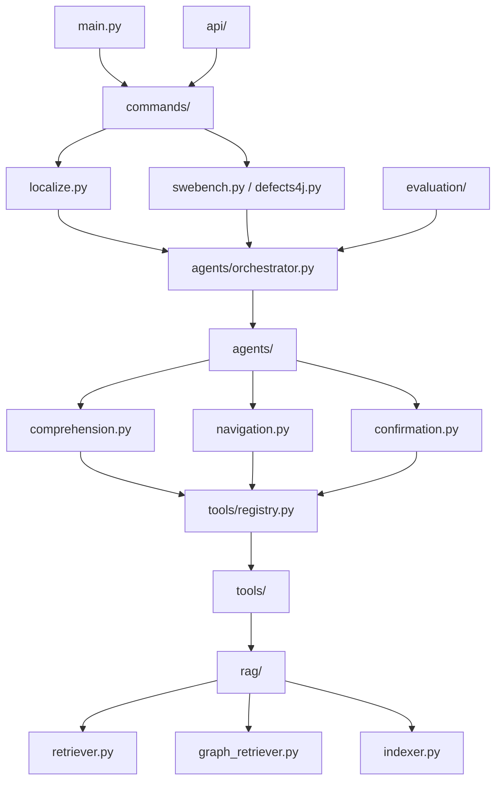

# Tài liệu Kiến trúc Hệ thống Bug Localization (Multi-Agent & RAG)

Tài liệu này mô tả kiến trúc tổng thể của hệ thống Bug Localization. Hệ thống sử dụng mô hình Multi-Agent kết hợp với Retrieval-Augmented Generation (RAG) và Code Property Graph (CPG) để tìm kiếm và định vị nguyên nhân gây lỗi trong mã nguồn một cách tự động.

---

## 1. Luồng xử lý tổng thể (Overall Pipeline Flowchart)

Luồng xử lý mô tả cách một Bug Report đầu vào được tiền xử lý và trải qua các vòng lặp của Multi-Agent System để ra kết quả định vị cuối cùng.

---

## 2. Mô hình Kiến trúc C4 (C4 Model)

Các biểu đồ dưới đây mô tả hệ thống theo tiêu chuẩn kiến trúc C4 Model (Context, Container, Component).

### 2.1 C4 - Context Diagram

Biểu đồ Context thể hiện hệ thống Bug Localization tương tác như thế nào với người dùng (Developer) và các hệ thống bên ngoài như VCS (Git), LLM Provider và Bug Tracker.

### 2.2 C4 - Container Diagram

Biểu đồ Container đi sâu vào các khối kiến trúc chính (vùng lưu trữ, logic nghiệp vụ, các pipeline module) bên trong Hệ thống Bug Localization.

### 2.3 C4 - Component Diagram (Multi-Agent Subsystem)

Biểu đồ Component mô tả sâu hơn cơ chế hoạt động tương tác bên trong `Multi-Agent System` kết nối với `Tools Registry` và `RAG & Graph Engine`.

---

## 3. Kiến Trúc RAG và Code Property Graph (CPG)

Một phần cốt lõi của hệ thống để hỗ trợ tác vụ Navigation của LLM là engine RAG và Code Property Graph.

---

## 4. Các luồng phụ thuộc Dependencies giữa các Modules

Biểu đồ thể hiện cách các module mã nguồn được tổ chức và liên kết phụ thuộc lẫn nhau trong file system (tham chiếu đến phần `10. Sơ Đồ Dependency Giữa Các Module` trong báo cáo kiến trúc).

Văn bản tài liệu này có thể được sử dụng làm file tham khảo để nhúng vào Github Wiki, Markdown Viewer, hoặc xuất báo cáo chính thức. Hệ thống hỗ trợ xem bằng các công cụ hiển thị Mermaid.js mặc định.
